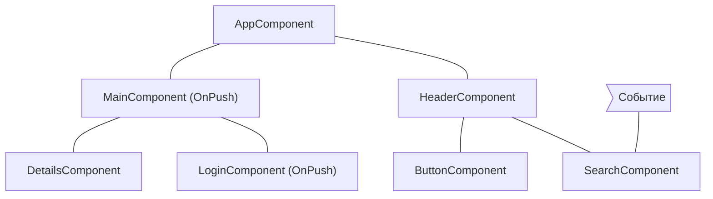
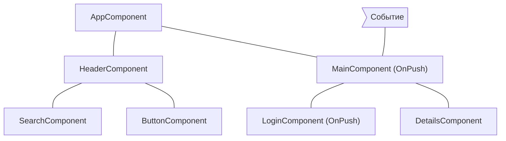
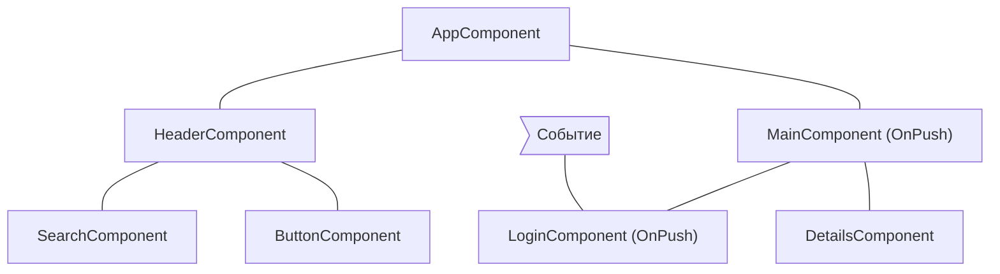
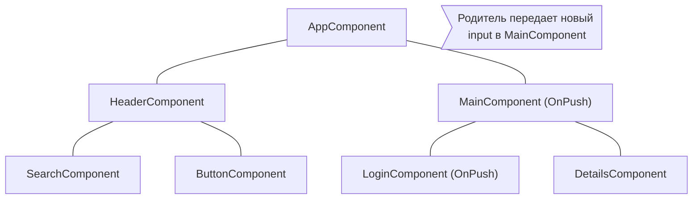

# Пропуск поддеревьев компонентов

JavaScript по умолчанию использует изменяемые структуры данных, на которые можно ссылаться из множества различных
компонентов. Angular запускает обнаружение изменений по всему дереву компонентов, чтобы убедиться, что самое актуальное
состояние ваших структур данных отражено в DOM.

Обнаружение изменений работает достаточно быстро для большинства приложений. Однако, когда приложение имеет особенно
большое дерево компонентов, запуск обнаружения изменений по всему приложению может вызвать проблемы с
производительностью. Вы можете решить эту проблему, настроив обнаружение изменений так, чтобы оно запускалось только для
подмножества дерева компонентов.

Если вы уверены, что часть приложения не затрагивается изменением состояния, вы можете
использовать [OnPush](/api/core/ChangeDetectionStrategy), чтобы пропустить обнаружение изменений во всем поддереве
компонентов.

## Использование `OnPush`

Стратегия обнаружения изменений OnPush указывает Angular запускать обнаружение изменений для поддерева компонентов \*
\*только\*\* когда:

- Корневой компонент поддерева получает новые входные данные (inputs) в результате привязки в шаблоне. Angular
  сравнивает текущее и предыдущее значение input-свойства с помощью `==`.
- Angular обрабатывает событие _(например, используя привязку событий, выходную привязку или `@HostListener`)_ в
  корневом компоненте поддерева или любом из его дочерних элементов, независимо от того, используют ли они стратегию
  OnPush или нет.

Вы можете установить стратегию обнаружения изменений компонента на `OnPush` в декораторе `@Component`:

```ts
import { ChangeDetectionStrategy, Component } from '@angular/core';

@Component({
  changeDetection: ChangeDetectionStrategy.OnPush,
})
export class MyComponent {}
```

## Распространенные сценарии обнаружения изменений

В этом разделе рассматриваются несколько распространенных сценариев обнаружения изменений для иллюстрации поведения
Angular.

### Событие обрабатывается компонентом со стратегией обнаружения изменений по умолчанию

Если Angular обрабатывает событие внутри компонента без стратегии `OnPush`, фреймворк выполняет обнаружение изменений во
всем дереве компонентов. Angular пропустит дочерние поддеревья компонентов с корнями, использующими `OnPush`, которые не
получили новых входных данных.

Например, если мы установим стратегию обнаружения изменений `MainComponent` на `OnPush`, а пользователь взаимодействует
с компонентом за пределами поддерева с корнем `MainComponent`, Angular проверит все розовые компоненты на диаграмме
ниже (`AppComponent`, `HeaderComponent`, `SearchComponent`, `ButtonComponent`), если только `MainComponent` не получит
новые входные данные:



## Событие обрабатывается компонентом с OnPush

Если Angular обрабатывает событие внутри компонента со стратегией OnPush, фреймворк выполнит обнаружение изменений во
всем дереве компонентов. Angular проигнорирует поддеревья компонентов с корнями, использующими OnPush, которые не
получили новых входных данных и находятся за пределами компонента, обработавшего событие.

Например, если Angular обрабатывает событие внутри `MainComponent`, фреймворк запустит обнаружение изменений во всем
дереве компонентов. Angular проигнорирует поддерево с корнем `LoginComponent`, так как оно имеет `OnPush`, и событие
произошло за пределами его области видимости.



## Событие обрабатывается потомком компонента с OnPush

Если Angular обрабатывает событие в компоненте с OnPush, фреймворк выполнит обнаружение изменений во всем дереве
компонентов, включая предков компонента.

Например, на диаграмме ниже Angular обрабатывает событие в `LoginComponent`, который использует OnPush. Angular вызовет
обнаружение изменений во всем поддереве компонентов, включая `MainComponent` (родитель `LoginComponent`), даже если
`MainComponent` также имеет `OnPush`. Angular проверяет `MainComponent` тоже, потому что `LoginComponent` является
частью его представления (view).



## Новые входные данные для компонента с OnPush

Angular запустит обнаружение изменений внутри дочернего компонента с `OnPush` при установке входного свойства (input) в
результате привязки в шаблоне.

Например, на диаграмме ниже `AppComponent` передает новые входные данные в `MainComponent`, который имеет `OnPush`.
Angular запустит обнаружение изменений в `MainComponent`, но не запустит его в `LoginComponent`, который также имеет
`OnPush`, если только он тоже не получит новые входные данные.



## Особые случаи

- **Изменение входных свойств в TypeScript-коде**. Когда вы используете API, такие как `@ViewChild` или `@ContentChild`,
  для получения ссылки на компонент в TypeScript и вручную изменяете свойство `@Input`, Angular не будет автоматически
  запускать обнаружение изменений для компонентов OnPush. Если вам нужно, чтобы Angular запустил обнаружение изменений,
  вы можете внедрить `ChangeDetectorRef` в ваш компонент и вызвать `changeDetectorRef.markForCheck()`, чтобы сообщить
  Angular о необходимости запланировать обнаружение изменений.
- **Изменение ссылок на объекты**. В случае, если input получает изменяемый объект в качестве значения, и вы изменяете
  объект, но сохраняете ссылку, Angular не вызовет обнаружение изменений. Это ожидаемое поведение, поскольку предыдущее
  и текущее значения input-свойства указывают на одну и ту же ссылку.
