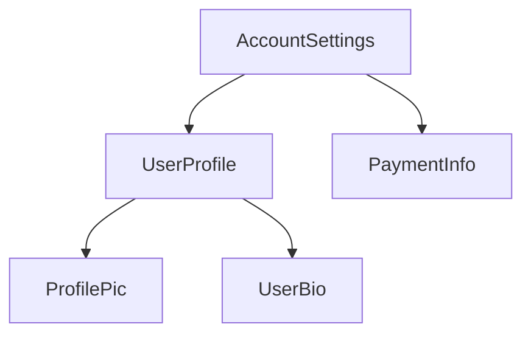

<docs-decorative-header title="Анатомия компонента" imgSrc="adev/src/assets/images/components.svg"> <!-- markdownlint-disable-line -->
</docs-decorative-header>

TIP: Это руководство предполагает, что вы уже прочитали [Руководство по основам](essentials). Прочитайте его первым,
если вы новичок в Angular.

Каждый компонент должен иметь:

- Класс TypeScript с _поведением (behaviors)_, таким как обработка пользовательского ввода и получение данных с сервера.
- HTML-шаблон, который управляет тем, что рендерится в DOM.
- [CSS-селектор](https://developer.mozilla.org/docs/Learn/CSS/Building_blocks/Selectors), который определяет, как
  компонент используется в HTML.

Вы предоставляете специфичную для Angular информацию для компонента,
добавляя [декоратор](https://www.typescriptlang.org/docs/handbook/decorators.html) `@Component` поверх класса
TypeScript:

```angular-ts {highlight: [1, 2, 3, 4]}
@Component({
  selector: 'profile-photo',
  template: ``,
})
export class ProfilePhoto { }
```

Для получения полной информации о написании шаблонов Angular, включая привязку данных, обработку событий и управление
потоком, см. [Руководство по шаблонам](guide/templates).

Объект, переданный в декоратор `@Component`, называется **метаданными** компонента. Сюда входят `selector`, `template` и
другие свойства, описанные в этом руководстве.

Компоненты могут опционально включать список стилей CSS, которые применяются к DOM этого компонента:

```angular-ts {highlight: [4]}
@Component({
  selector: 'profile-photo',
  template: ``,
  styles: `img { border-radius: 50%; }`,
})
export class ProfilePhoto { }
```

По умолчанию стили компонента влияют только на элементы, определенные в шаблоне этого компонента.
См. [Стилизация компонентов](guide/components/styling) для получения подробной информации о подходе Angular к
стилизации.

В качестве альтернативы вы можете написать свой шаблон и стили в отдельных файлах:

```ts {highlight: [3,4]}
@Component({
  selector: 'profile-photo',
  templateUrl: 'profile-photo.html',
  styleUrl: 'profile-photo.css',
})
export class ProfilePhoto { }
```

Это может помочь отделить вопросы _представления (presentation)_ от _поведения (behavior)_ в вашем проекте. Вы можете
выбрать один подход для всего проекта или решать, какой использовать для каждого компонента.

И `templateUrl`, и `styleUrl` являются относительными к каталогу, в котором находится компонент.

## Использование компонентов

### Импорты в декораторе `@Component`

Чтобы использовать компонент, [директиву](guide/directives) или [пайп](guide/templates/pipes), вы должны добавить их в
массив `imports` в декораторе `@Component`:

```ts
import {ProfilePhoto} from './profile-photo';

@Component({
  // Импортируем компонент `ProfilePhoto`, чтобы
  // использовать его в шаблоне этого компонента.
  imports: [ProfilePhoto],
  /* ... */
})
export class UserProfile { }
```

По умолчанию компоненты Angular являются _автономными (standalone)_, что означает, что вы можете напрямую добавлять их в
массив `imports` других компонентов. Компоненты, созданные с более ранней версией Angular, могут вместо этого указывать
`standalone: false` в своем декораторе `@Component`. Для этих компонентов вы вместо этого импортируете `NgModule`, в
котором определен компонент. См. полное [руководство по `NgModule`](guide/ngmodules) для получения подробной информации.

Важно: В версиях Angular до 19.0.0 опция `standalone` по умолчанию была `false`.

### Отображение компонентов в шаблоне

Каждый компонент определяет [CSS-селектор](https://developer.mozilla.org/docs/Learn/CSS/Building_blocks/Selectors):

```angular-ts {highlight: [2]}
@Component({
  selector: 'profile-photo',
  ...
})
export class ProfilePhoto { }
```

См. [Селекторы компонентов](guide/components/selectors) для получения подробной информации о типах селекторов,
поддерживаемых Angular, и рекомендаций по выбору селектора.

Вы показываете компонент, создавая соответствующий HTML-элемент в шаблоне _других_ компонентов:

```angular-ts {highlight: [8]}
@Component({
  selector: 'profile-photo',
})
export class ProfilePhoto { }

@Component({
imports: [ProfilePhoto],
template: `<profile-photo />`
})
export class UserProfile { }
```

Angular создает экземпляр компонента для каждого встреченного соответствующего HTML-элемента. DOM-элемент, который
соответствует селектору компонента, называется **хост-элементом (host element)** этого компонента. Содержимое шаблона
компонента рендерится внутри его хост-элемента.

DOM, отрисованный компонентом, соответствующий шаблону этого компонента, называется **представлением (view)** этого
компонента.

При компоновке компонентов таким образом, **вы можете думать о своем приложении Angular как о дереве компонентов**.



Эта древовидная структура важна для понимания нескольких других концепций Angular,
включая [внедрение зависимостей](guide/di) и [дочерние запросы (child queries)](guide/components/queries).
