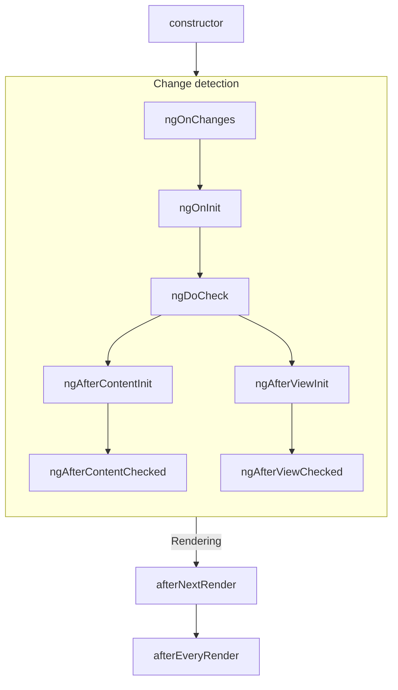
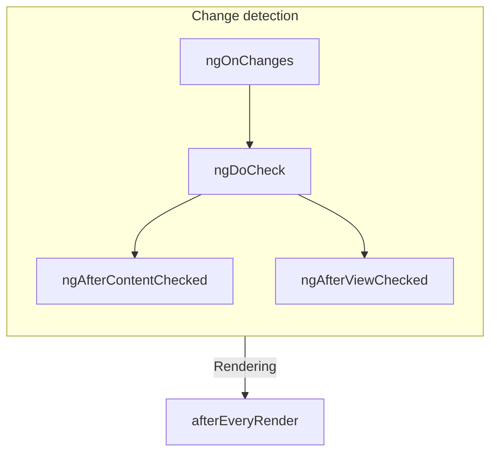

# Жизненный цикл компонента

СОВЕТ: Это руководство предполагает, что вы уже прочитали [Руководство по основам](essentials). Прочтите его сначала,
если вы новичок в Angular.

**Жизненный цикл** компонента — это последовательность шагов, происходящих между созданием компонента и его
уничтожением. Каждый шаг представляет собой отдельную часть процесса Angular по рендерингу компонентов и проверке их на
наличие обновлений с течением времени.

В своих компонентах вы можете реализовать **хуки жизненного цикла** для выполнения кода на этих этапах. Хуки жизненного
цикла, относящиеся к конкретному экземпляру компонента, реализуются как методы класса вашего компонента. Хуки жизненного
цикла, относящиеся к приложению Angular в целом, реализуются как функции, принимающие колбэк.

Жизненный цикл компонента тесно связан с тем, как Angular проверяет ваши компоненты на наличие изменений с течением
времени. Для понимания этого жизненного цикла достаточно знать, что Angular обходит дерево вашего приложения сверху
вниз, проверяя привязки шаблонов на наличие изменений. Описанные ниже хуки жизненного цикла запускаются, пока Angular
выполняет этот обход. Этот обход посещает каждый компонент ровно один раз, поэтому вам всегда следует избегать внесения
дальнейших изменений состояния в середине этого процесса.

## Краткое описание

<div class="docs-table docs-scroll-track-transparent">
  <table>
    <tr>
      <td><strong>Фаза</strong></td>
      <td><strong>Метод</strong></td>
      <td><strong>Краткое описание</strong></td>
    </tr>
    <tr>
      <td>Создание</td>
      <td><code>constructor</code></td>
      <td>
        <a href="https://developer.mozilla.org/docs/Web/JavaScript/Reference/Classes/constructor" target="_blank">
          Стандартный конструктор класса JavaScript
        </a>. Запускается, когда Angular создает экземпляр компонента.
      </td>
    </tr>
    <tr>
      <td rowspan="7">Обнаружение<p>изменений</td>
      <td><code>ngOnInit</code>
      </td>
      <td>Запускается один раз после того, как Angular инициализировал все Input-ы компонента.</td>
    </tr>
    <tr>
      <td><code>ngOnChanges</code></td>
      <td>Запускается каждый раз, когда изменяются Input-ы компонента.</td>
    </tr>
    <tr>
      <td><code>ngDoCheck</code></td>
      <td>Запускается каждый раз, когда этот компонент проверяется на наличие изменений.</td>
    </tr>
    <tr>
      <td><code>ngAfterContentInit</code></td>
      <td>Запускается один раз после инициализации <em>контента</em> компонента.</td>
    </tr>
    <tr>
      <td><code>ngAfterContentChecked</code></td>
      <td>Запускается каждый раз, когда контент этого компонента проверяется на наличие изменений.</td>
    </tr>
    <tr>
      <td><code>ngAfterViewInit</code></td>
      <td>Запускается один раз после инициализации <em>представления</em> (view) компонента.</td>
    </tr>
    <tr>
      <td><code>ngAfterViewChecked</code></td>
      <td>Запускается каждый раз, когда представление компонента проверяется на наличие изменений.</td>
    </tr>
    <tr>
      <td rowspan="2">Рендеринг</td>
      <td><code>afterNextRender</code></td>
      <td>Запускается один раз в следующий момент, когда <strong>все</strong> компоненты будут отрисованы в DOM.</td>
    </tr>
    <tr>
      <td><code>afterEveryRender</code></td>
      <td>Запускается каждый раз, когда <strong>все</strong> компоненты отрисовываются в DOM.</td>
    </tr>
    <tr>
      <td>Уничтожение</td>
      <td><code>ngOnDestroy</code></td>
      <td>Запускается один раз перед уничтожением компонента.</td>
    </tr>
  </table>
</div>

### ngOnInit

Метод `ngOnInit` запускается после того, как Angular инициализирует все Input-ы компонента их начальными значениями.
`ngOnInit` компонента запускается ровно один раз.

Этот шаг происходит _до_ инициализации собственного шаблона компонента. Это означает, что вы можете обновить состояние
компонента на основе его начальных входных значений.

### ngOnChanges

Метод `ngOnChanges` запускается после изменения любых Input-ов компонента.

Этот шаг происходит _до_ проверки собственного шаблона компонента. Это означает, что вы можете обновить состояние
компонента на основе его начальных входных значений.

При инициализации первый `ngOnChanges` запускается перед `ngOnInit`.

#### Проверка изменений

Метод `ngOnChanges` принимает один аргумент `SimpleChanges`. Этот объект представляет собой [
`Record`](https://www.typescriptlang.org/docs/handbook/utility-types.html#recordkeys-type), сопоставляющий имя каждого
Input-а компонента с объектом `SimpleChange`. Каждый `SimpleChange` содержит предыдущее значение Input-а, его текущее
значение и флаг, указывающий, является ли это изменение первым.

Вы можете опционально передать текущий класс или `this` в качестве первого generic-аргумента для более строгой проверки
типов.

```ts
@Component({
  /* ... */
})
export class UserProfile {
  name = input('');

  ngOnChanges(changes: SimpleChanges<UserProfile>) {
    if (changes.name) {
      console.log(`Previous: ${changes.name.previousValue}`);
      console.log(`Current: ${changes.name.currentValue}`);
      console.log(`Is first ${changes.name.firstChange}`);
    }
  }
}
```

Если вы укажете псевдоним (`alias`) для каких-либо входных свойств, запись `SimpleChanges` по-прежнему будет
использовать имя свойства TypeScript в качестве ключа, а не псевдоним.

### ngOnDestroy

Метод `ngOnDestroy` запускается один раз непосредственно перед уничтожением компонента. Angular уничтожает компонент,
когда он больше не отображается на странице, например, скрыт с помощью `@if` или при переходе на другую страницу.

#### DestroyRef

В качестве альтернативы методу `ngOnDestroy` вы можете внедрить экземпляр `DestroyRef`. Вы можете зарегистрировать
колбэк, который будет вызван при уничтожении компонента, вызвав метод `onDestroy` у `DestroyRef`.

```ts
@Component({
  /* ... */
})
export class UserProfile {
  constructor() {
    inject(DestroyRef).onDestroy(() => {
      console.log('UserProfile destruction');
    });
  }
}
```

Вы можете передавать экземпляр `DestroyRef` функциям или классам за пределами вашего компонента. Используйте этот
паттерн, если у вас есть другой код, который должен выполнять очистку при уничтожении компонента.

Вы также можете использовать `DestroyRef`, чтобы держать код настройки рядом с кодом очистки, вместо того чтобы помещать
весь код очистки в метод `ngOnDestroy`.

##### Обнаружение уничтожения экземпляра

`DestroyRef` предоставляет свойство `destroyed`, которое позволяет проверить, был ли данный экземпляр уже уничтожен. Это
полезно для предотвращения операций над уничтоженными компонентами, особенно при работе с отложенной или асинхронной
логикой.

Проверяя `destroyRef.destroyed`, вы можете предотвратить выполнение кода после очистки экземпляра, избегая потенциальных
ошибок, таких как `NG0911: View has already been destroyed.`.

### ngDoCheck

Метод `ngDoCheck` запускается перед каждой проверкой шаблона компонента Angular на наличие изменений.

Вы можете использовать этот хук жизненного цикла для ручной проверки изменений состояния вне обычного механизма
обнаружения изменений Angular, обновляя состояние компонента вручную.

Этот метод запускается очень часто и может существенно повлиять на производительность вашей страницы. Избегайте
определения этого хука, когда это возможно, используя его только тогда, когда у вас нет альтернативы.

При инициализации первый `ngDoCheck` запускается после `ngOnInit`.

### ngAfterContentInit

Метод `ngAfterContentInit` запускается один раз после инициализации всех дочерних элементов, вложенных в компонент (его
_контента_).

Вы можете использовать этот хук жизненного цикла для чтения
результатов [запросов контента](guide/components/queries#content-queries). Хотя вы можете получить доступ к
инициализированному состоянию этих запросов, попытка изменить какое-либо состояние в этом методе приведет к
ошибке [ExpressionChangedAfterItHasBeenCheckedError](errors/NG0100).

### ngAfterContentChecked

Метод `ngAfterContentChecked` запускается каждый раз, когда дочерние элементы, вложенные в компонент (его _контент_),
проверяются на наличие изменений.

Этот метод запускается очень часто и может существенно повлиять на производительность вашей страницы. Избегайте
определения этого хука, когда это возможно, используя его только тогда, когда у вас нет альтернативы.

Хотя здесь вы можете получить доступ к обновленному
состоянию [запросов контента](guide/components/queries#content-queries), попытка изменить какое-либо состояние в этом
методе приведет к ошибке [ExpressionChangedAfterItHasBeenCheckedError](errors/NG0100).

### ngAfterViewInit

Метод `ngAfterViewInit` запускается один раз после инициализации всех дочерних элементов в шаблоне компонента (его
_представления_).

Вы можете использовать этот хук жизненного цикла для чтения
результатов [запросов представления](guide/components/queries#view-queries). Хотя вы можете получить доступ к
инициализированному состоянию этих запросов, попытка изменить какое-либо состояние в этом методе приведет к
ошибке [ExpressionChangedAfterItHasBeenCheckedError](errors/NG0100).

### ngAfterViewChecked

Метод `ngAfterViewChecked` запускается каждый раз, когда дочерние элементы в шаблоне компонента (его _представление_)
проверяются на наличие изменений.

Этот метод запускается очень часто и может существенно повлиять на производительность вашей страницы. Избегайте
определения этого хука, когда это возможно, используя его только тогда, когда у вас нет альтернативы.

Хотя здесь вы можете получить доступ к обновленному
состоянию [запросов представления](guide/components/queries#view-queries), попытка изменить какое-либо состояние в этом
методе приведет к ошибке [ExpressionChangedAfterItHasBeenCheckedError](errors/NG0100).

### afterEveryRender и afterNextRender

Функции `afterEveryRender` и `afterNextRender` позволяют зарегистрировать **колбэк рендеринга**, который будет вызван
после того, как Angular закончит рендеринг _всех компонентов_ на странице в DOM.

Эти функции отличаются от других хуков жизненного цикла, описанных в этом руководстве. Вместо метода класса, они
представляют собой отдельные функции, принимающие колбэк. Выполнение колбэков рендеринга не привязано к какому-либо
конкретному экземпляру компонента, а является хуком уровня всего приложения.

`afterEveryRender` и `afterNextRender` должны вызываться в [контексте внедрения](guide/di/dependency-injection-context),
обычно в конструкторе компонента.

Вы можете использовать колбэки рендеринга для выполнения ручных операций с DOM.
См. [Использование DOM API](guide/components/dom-apis) для получения рекомендаций по работе с DOM в Angular.

Колбэки рендеринга не запускаются во время рендеринга на стороне сервера (SSR) или во время предварительного
рендеринга (pre-rendering) при сборке.

#### Фазы after\*Render

При использовании `afterEveryRender` или `afterNextRender` вы можете опционально разделить работу на фазы. Фаза дает вам
контроль над последовательностью операций DOM, позволяя упорядочить операции _записи_ перед операциями _чтения_, чтобы
минимизировать [layout thrashing](https://web.dev/avoid-large-complex-layouts-and-layout-thrashing). Для передачи данных
между фазами функция фазы может возвращать результат, к которому можно получить доступ в следующей фазе.

```ts
import {Component, ElementRef, afterNextRender} from '@angular/core';

@Component({...})
export class UserProfile {
  private prevPadding = 0;
  private elementHeight = 0;

  constructor() {
    private elementRef = inject(ElementRef);
    const nativeElement = elementRef.nativeElement;

    afterNextRender({
      // Use the `Write` phase to write to a geometric property.
      write: () => {
        const padding = computePadding();
        const changed = padding !== this.prevPadding;
        if (changed) {
          nativeElement.style.padding = padding;
        }
        return changed; // Communicate whether anything changed to the read phase.
      },

      // Use the `Read` phase to read geometric properties after all writes have occurred.
      read: (didWrite) => {
        if (didWrite) {
          this.elementHeight = nativeElement.getBoundingClientRect().height;
        }
      }
    });
  }
}
```

Существует четыре фазы, выполняемые в следующем порядке:

| Фаза             | Описание                                                                                                                                                                                                                           |
| ---------------- | ---------------------------------------------------------------------------------------------------------------------------------------------------------------------------------------------------------------------------------- |
| `earlyRead`      | Используйте эту фазу для чтения любых свойств DOM и стилей, влияющих на макет (layout), которые строго необходимы для последующих вычислений. Избегайте этой фазы, если это возможно, отдавая предпочтение фазам `write` и `read`. |
| `write`          | Используйте эту фазу для записи свойств DOM и стилей, влияющих на макет.                                                                                                                                                           |
| `mixedReadWrite` | Фаза по умолчанию. Используйте для любых операций, требующих как чтения, так и записи свойств и стилей, влияющих на макет. Избегайте этой фазы, если это возможно, отдавая предпочтение явным фазам `write` и `read`.              |
| `read`           | Используйте эту фазу для чтения любых свойств DOM, влияющих на макет.                                                                                                                                                              |

## Интерфейсы жизненного цикла

Angular предоставляет интерфейс TypeScript для каждого метода жизненного цикла. Вы можете опционально импортировать и
реализовать (`implement`) эти интерфейсы, чтобы убедиться, что в вашей реализации нет опечаток или ошибок в написании.

Каждый интерфейс имеет то же имя, что и соответствующий метод, но без префикса `ng`. Например, интерфейсом для
`ngOnInit` является `OnInit`.

```ts
@Component({
  /* ... */
})
export class UserProfile implements OnInit {
  ngOnInit() {
    /* ... */
  }
}
```

## Порядок выполнения

Следующие диаграммы показывают порядок выполнения хуков жизненного цикла Angular.

### При инициализации



### Последующие обновления



### Порядок выполнения с директивами

Когда вы помещаете одну или несколько директив на тот же элемент, что и компонент (либо в шаблоне, либо с помощью
свойства `hostDirectives`), фреймворк не гарантирует какой-либо порядок выполнения данного хука жизненного цикла между
компонентом и директивами на одном элементе. Никогда не полагайтесь на наблюдаемый порядок, так как он может измениться
в будущих версиях Angular.
