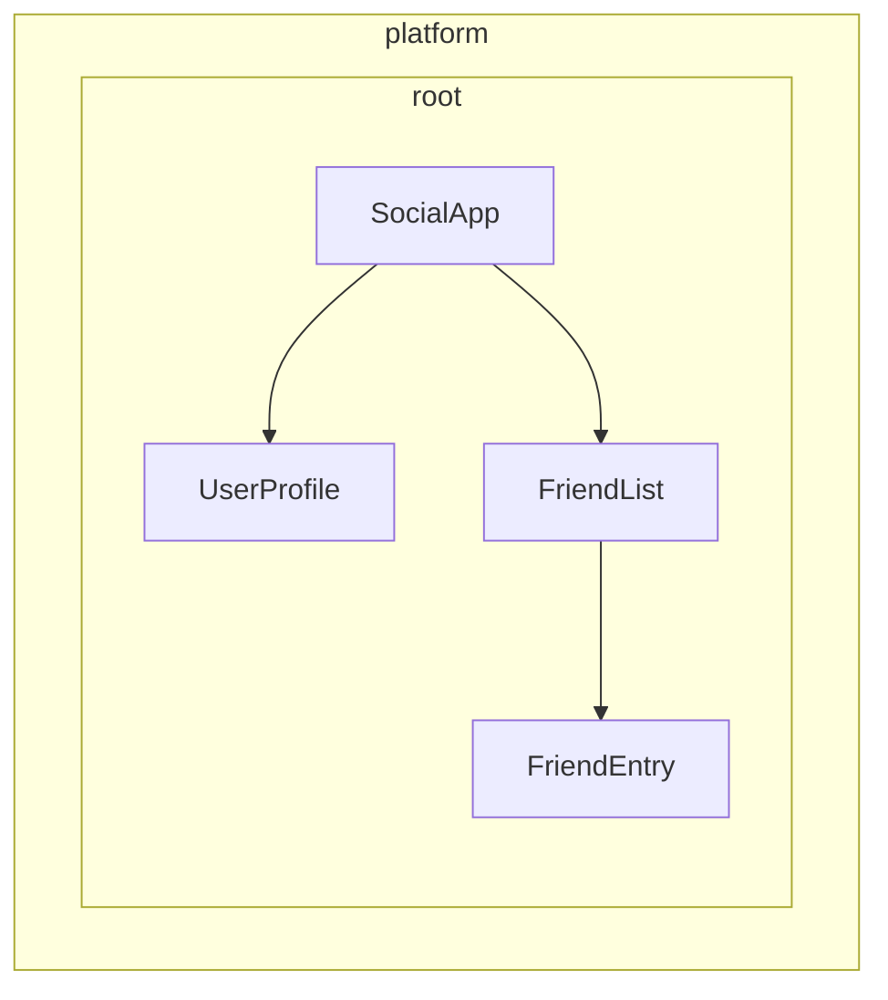

# Определение провайдеров зависимостей

Angular предоставляет два способа сделать сервисы доступными для внедрения:

1.  **Автоматическое предоставление** — использование `providedIn` в декораторе `@Injectable` или предоставление фабрики в конфигурации `InjectionToken`.
2.  **Ручное предоставление** — использование массива `providers` в компонентах, директивах, маршрутах или конфигурации приложения.

В [предыдущем руководстве](/guide/di/creating-and-using-services) вы узнали, как создавать сервисы с использованием `providedIn: 'root'`, что покрывает большинство распространенных случаев использования. В этом руководстве рассматриваются дополнительные паттерны как для автоматической, так и для ручной настройки провайдеров.

## Автоматическое предоставление для зависимостей, не являющихся классами

Хотя декоратор `@Injectable` с `providedIn: 'root'` отлично работает для сервисов (классов), вам может понадобиться предоставить другие типы значений глобально — например, объекты конфигурации, функции или примитивные значения. Для этой цели Angular предоставляет `InjectionToken`.

### Что такое InjectionToken?

`InjectionToken` — это объект, который система внедрения зависимостей Angular использует для уникальной идентификации значений для внедрения. Думайте о нем как о специальном ключе, который позволяет сохранять и извлекать любой тип значения в системе DI Angular:

```ts
import { InjectionToken } from '@angular/core';

// Create a token for a string value
export const API_URL = new InjectionToken<string>('api.url');

// Create a token for a function
export const LOGGER = new InjectionToken<(msg: string) => void>('logger.function');

// Create a token for a complex type
export interface Config {
  apiUrl: string;
  timeout: number;
}
export const CONFIG_TOKEN = new InjectionToken<Config>('app.config');
```

ПРИМЕЧАНИЕ: Строковый параметр (например, `'api.url'`) — это описание исключительно для отладки. Angular идентифицирует токены по ссылке на объект, а не по этой строке.

### InjectionToken с `providedIn: 'root'`

`InjectionToken`, имеющий `factory`, по умолчанию получает `providedIn: 'root'` (но это можно переопределить через свойство `providedIn`).

```ts
// 📁 /app/config.token.ts
import { InjectionToken } from '@angular/core';

export interface AppConfig {
  apiUrl: string;
  version: string;
  features: Record<string, boolean>;
}

// Globally available configuration using providedIn
export const APP_CONFIG = new InjectionToken<AppConfig>('app.config', {
  providedIn: 'root',
  factory: () => ({
    apiUrl: 'https://api.example.com',
    version: '1.0.0',
    features: {
      darkMode: true,
      analytics: false
    }
  })
});

// No need to add to providers array - available everywhere!
@Component({
  selector: 'app-header',
  template: `<h1>Version: {{ config.version }}</h1>`
})
export class HeaderComponent {
  config = inject(APP_CONFIG); // Automatically available
}
```

### Когда использовать InjectionToken с фабричными функциями

`InjectionToken` с фабричными функциями идеально подходит, когда вы не можете использовать класс, но вам нужно предоставить зависимости глобально:

```ts
// 📁 /app/logger.token.ts
import { InjectionToken, inject } from '@angular/core';
import { APP_CONFIG } from './config.token';

// Logger function type
export type LoggerFn = (level: string, message: string) => void;

// Global logger function with dependencies
export const LOGGER_FN = new InjectionToken<LoggerFn>('logger.function', {
  providedIn: 'root',
  factory: () => {
    const config = inject(APP_CONFIG);

    return (level: string, message: string) => {
      if (config.features.logging !== false) {
        console[level](`[${new Date().toISOString()}] ${message}`);
      }
    };
  }
});

// 📁 /app/storage.token.ts
// Providing browser APIs as tokens
export const LOCAL_STORAGE = new InjectionToken<Storage>('localStorage', {
  // providedIn: 'root' is configured as the default
  factory: () => window.localStorage
});

export const SESSION_STORAGE = new InjectionToken<Storage>('sessionStorage', {
  providedIn: 'root',
  factory: () => window.sessionStorage
});

// 📁 /app/feature-flags.token.ts
// Complex configuration with runtime logic
export const FEATURE_FLAGS = new InjectionToken<Map<string, boolean>>('feature.flags', {
  providedIn: 'root',
  factory: () => {
    const flags = new Map<string, boolean>();

    // Parse from environment or URL params
    const urlParams = new URLSearchParams(window.location.search);
    const enableBeta = urlParams.get('beta') === 'true';

    flags.set('betaFeatures', enableBeta);
    flags.set('darkMode', true);
    flags.set('newDashboard', false);

    return flags;
  }
});
```

Этот подход имеет ряд преимуществ:

-   **Не требуется ручная настройка провайдера** — работает так же, как `providedIn: 'root'` для сервисов.
-   **Tree-shakeable** — включается в сборку только при фактическом использовании.
-   **Типобезопасность** — полная поддержка TypeScript для значений, не являющихся классами.
-   **Возможность внедрять другие зависимости** — фабричные функции могут использовать `inject()` для доступа к другим сервисам.

## Понимание ручной настройки провайдеров

Когда вам нужно больше контроля, чем предлагает `providedIn: 'root'`, вы можете настроить провайдеры вручную. Ручная настройка через массив `providers` полезна, когда:

1.  **У сервиса нет `providedIn`** — сервисы без автоматического предоставления должны быть предоставлены вручную.
2.  **Вы хотите создать новый экземпляр** — чтобы создать отдельный экземпляр на уровне компонента/директивы вместо использования общего.
3.  **Нужна конфигурация во время выполнения** — когда поведение сервиса зависит от значений времени выполнения.
4.  **Вы предоставляете значения, не являющиеся классами** — объекты конфигурации, функции или примитивные значения.

### Пример: Сервис без `providedIn`

```ts
import { Injectable, Component, inject } from '@angular/core';

// Service without providedIn
@Injectable()
export class LocalDataStore {
  private data: string[] = [];

  addData(item: string) {
    this.data.push(item);
  }
}

// Component must provide it
@Component({
  selector: 'app-example',
  // A provider is required here because the `LocalDataStore` service has no providedIn.
  providers: [LocalDataStore],
  template: `...`
})
export class ExampleComponent {
  dataStore = inject(LocalDataStore);
}
```

### Пример: Создание экземпляров для конкретного компонента

Сервисы с `providedIn: 'root'` могут быть переопределены на уровне компонента. Это связывает экземпляр сервиса с жизненным циклом компонента. В результате, когда компонент уничтожается, предоставленный сервис также уничтожается.

```ts
import { Injectable, Component, inject } from '@angular/core';

@Injectable({ providedIn: 'root' })
export class DataStore {
  private data: ListItem[] = [];
}

// This component gets its own instance
@Component({
  selector: 'app-isolated',
  // Creates new instance of `DataStore` rather than using the root-provided instance.
  providers: [DataStore],
  template: `...`
})
export class IsolatedComponent {
  dataStore = inject(DataStore); // Component-specific instance
}
```

## Иерархия инжекторов в Angular

Система внедрения зависимостей Angular является иерархической. Когда компонент запрашивает зависимость, Angular начинает с инжектора этого компонента и поднимается вверх по дереву, пока не найдет провайдер для этой зависимости. Каждый компонент в дереве вашего приложения может иметь свой собственный инжектор, и эти инжекторы образуют иерархию, отражающую дерево компонентов.

Эта иерархия обеспечивает:

-   **Экземпляры с ограниченной областью видимости**: Разные части вашего приложения могут иметь разные экземпляры одного и того же сервиса.
-   **Поведение переопределения**: Дочерние компоненты могут переопределять провайдеры родительских компонентов.
-   **Эффективность использования памяти**: Сервисы создаются только там, где они необходимы.

В Angular любой элемент с компонентом или директивой может предоставлять значения всем своим потомкам.



В примере выше:

1.  `SocialApp` может предоставлять значения для `UserProfile` и `FriendList`.
2.  `FriendList` может предоставлять значения для внедрения в `FriendEntry`, но не может предоставлять значения для `UserProfile`, так как тот не является частью этого дерева.

## Объявление провайдера

Представьте систему внедрения зависимостей Angular как хеш-карту или словарь. Каждый объект конфигурации провайдера определяет пару ключ-значение:

-   **Ключ (Идентификатор провайдера)**: Уникальный идентификатор, который вы используете для запроса зависимости.
-   **Значение**: То, что Angular должен вернуть при запросе этого токена.

При ручном предоставлении зависимостей вы обычно видите такой сокращенный синтаксис:

```angular-ts
import { Component } from '@angular/core';
import { LocalService } from './local-service';

@Component({
  selector: 'app-example',
  providers: [LocalService]  // Service without providedIn
})
export class ExampleComponent { }
```

На самом деле это сокращение для более детальной конфигурации провайдера:

```ts
{
  // This is the shorthand version
  providers: [LocalService],

  // This is the full version
  providers: [
    { provide: LocalService, useClass: LocalService }
  ]
}
```

### Объект конфигурации провайдера

Каждый объект конфигурации провайдера состоит из двух основных частей:

1.  **Идентификатор провайдера**: Уникальный ключ, который Angular использует для получения зависимости (устанавливается через свойство `provide`).
2.  **Значение**: Фактическая зависимость, которую вы хотите, чтобы Angular извлек, настроенная с помощью различных ключей в зависимости от желаемого типа:
    -   `useClass` — Предоставляет класс JavaScript.
    -   `useValue` — Предоставляет статическое значение.
    -   `useFactory` — Предоставляет фабричную функцию, которая возвращает значение.
    -   `useExisting` — Предоставляет псевдоним для существующего провайдера.

### Идентификаторы провайдеров

Идентификаторы провайдеров позволяют системе внедрения зависимостей (DI) Angular получать зависимость по уникальному ID. Вы можете генерировать идентификаторы провайдеров двумя способами:

1.  [Имена классов](#class-names)
2.  [Токены внедрения (Injection tokens)](#injection-tokens)

#### Имена классов

Имя класса использует импортированный класс непосредственно в качестве идентификатора:

```angular-ts
import { Component } from '@angular/core';
import { LocalService } from './local-service';

@Component({
  selector: 'app-example',
  providers: [
    { provide: LocalService, useClass: LocalService }
  ]
})
export class ExampleComponent { /* ... */ }
```

Класс служит одновременно и идентификатором, и реализацией, поэтому Angular предоставляет сокращение `providers: [LocalService]`.

#### Токены внедрения (Injection tokens)

Angular предоставляет встроенный класс [`InjectionToken`](api/core/InjectionToken), который создает уникальную ссылку на объект для внедряемых значений или когда вы хотите предоставить несколько реализаций одного интерфейса.

```ts
// 📁 /app/tokens.ts
import { InjectionToken } from '@angular/core';
import { DataService } from './data-service.interface';

export const DATA_SERVICE_TOKEN = new InjectionToken<DataService>('DataService');
```

ПРИМЕЧАНИЕ: Строка `'DataService'` — это описание, используемое исключительно для отладки. Angular идентифицирует токены по ссылке на объект, а не по этой строке.

Используйте токен в конфигурации провайдера:

```angular-ts
import { Component, inject } from '@angular/core';
import { LocalDataService } from './local-data-service';
import { DATA_SERVICE_TOKEN } from './tokens';

@Component({
  selector: 'app-example',
  providers: [
    { provide: DATA_SERVICE_TOKEN, useClass: LocalDataService }
  ]
})
export class ExampleComponent {
  private dataService = inject(DATA_SERVICE_TOKEN);
}
```

#### Могут ли интерфейсы TypeScript быть идентификаторами для внедрения?

Интерфейсы TypeScript нельзя использовать для внедрения, так как они не существуют во время выполнения:

```ts
// ❌ This won't work!
interface DataService {
  getData(): string[];
}

// Interfaces disappear after TypeScript compilation
@Component({
  providers: [
    { provide: DataService, useClass: LocalDataService } // Error!
  ]
})
export class ExampleComponent {
  private dataService = inject(DataService); // Error!
}

// ✅ Use InjectionToken instead
export const DATA_SERVICE_TOKEN = new InjectionToken<DataService>('DataService');

@Component({
  providers: [
    { provide: DATA_SERVICE_TOKEN, useClass: LocalDataService }
  ]
})
export class ExampleComponent {
  private dataService = inject(DATA_SERVICE_TOKEN); // Works!
}
```

`InjectionToken` предоставляет значение времени выполнения, которое может использовать система DI Angular, сохраняя при этом типобезопасность благодаря параметру универсального типа (generic) TypeScript.

### Типы значений провайдера

#### useClass

`useClass` предоставляет класс JavaScript в качестве зависимости. Это значение по умолчанию при использовании сокращенного синтаксиса:

```ts
// Shorthand
providers: [DataService]

// Full syntax
providers: [
  { provide: DataService, useClass: DataService }
]

// Different implementation
providers: [
  { provide: DataService, useClass: MockDataService }
]

// Conditional implementation
providers: [
  {
    provide: StorageService,
    useClass: environment.production ? CloudStorageService : LocalStorageService
  }
]
```

#### Практический пример: Замена логгера

Вы можете подменять реализации для расширения функциональности:

```ts
import { Injectable, Component, inject } from '@angular/core';

// Base logger
@Injectable()
export class Logger {
  log(message: string) {
    console.log(message);
  }
}

// Enhanced logger with timestamp
@Injectable()
export class BetterLogger extends Logger {
  override log(message: string) {
    super.log(`[${new Date().toISOString()}] ${message}`);
  }
}

// Logger that includes user context
@Injectable()
export class EvenBetterLogger extends Logger {
  private userService = inject(UserService);

  override log(message: string) {
    const name = this.userService.user.name;
    super.log(`Message to ${name}: ${message}`);
  }
}

// In your component
@Component({
  selector: 'app-example',
  providers: [
    UserService, // EvenBetterLogger needs this
    { provide: Logger, useClass: EvenBetterLogger }
  ]
})
export class ExampleComponent {
  private logger = inject(Logger); // Gets EvenBetterLogger instance
}
```

#### useValue

`useValue` предоставляет любой тип данных JavaScript как статическое значение:

```ts
providers: [
  { provide: API_URL_TOKEN, useValue: 'https://api.example.com' },
  { provide: MAX_RETRIES_TOKEN, useValue: 3 },
  { provide: FEATURE_FLAGS_TOKEN, useValue: { darkMode: true, beta: false } }
]
```

ВАЖНО: Типы и интерфейсы TypeScript не могут служить значениями зависимостей. Они существуют только во время компиляции.

#### Практический пример: Конфигурация приложения

Распространенный случай использования `useValue` — предоставление конфигурации приложения:

```ts
// Define configuration interface
export interface AppConfig {
  apiUrl: string;
  appTitle: string;
  features: {
    darkMode: boolean;
    analytics: boolean;
  };
}

// Create injection token
export const APP_CONFIG = new InjectionToken<AppConfig>('app.config');

// Define configuration
const appConfig: AppConfig = {
  apiUrl: 'https://api.example.com',
  appTitle: 'My Application',
  features: {
    darkMode: true,
    analytics: false
  }
};

// Provide in bootstrap
bootstrapApplication(AppComponent, {
  providers: [
    { provide: APP_CONFIG, useValue: appConfig }
  ]
});

// Use in component
@Component({
  selector: 'app-header',
  template: `<h1>{{ title }}</h1>`
})
export class HeaderComponent {
  private config = inject(APP_CONFIG);
  title = this.config.appTitle;
}
```

#### useFactory

`useFactory` предоставляет функцию, которая генерирует новое значение для внедрения:

```ts
export const loggerFactory = (config: AppConfig) => {
  return new LoggerService(config.logLevel, config.endpoint);
};

providers: [
  {
    provide: LoggerService,
    useFactory: loggerFactory,
    deps: [APP_CONFIG]  // Dependencies for the factory function
  }
]
```

Вы можете пометить зависимости фабрики как необязательные:

```ts
import { Optional } from '@angular/core';

providers: [
  {
    provide: MyService,
    useFactory: (required: RequiredService, optional?: OptionalService) => {
      return new MyService(required, optional || new DefaultService());
    },
    deps: [RequiredService, [new Optional(), OptionalService]]
  }
]
```

#### Практический пример: API-клиент на основе конфигурации

Вот полный пример, показывающий, как использовать фабрику для создания сервиса с конфигурацией во время выполнения:

```ts
// Service that needs runtime configuration
class ApiClient {
  constructor(
    private http: HttpClient,
    private baseUrl: string,
    private rateLimitMs: number
  ) {}

  async fetchData(endpoint: string) {
    // Apply rate limiting based on user tier
    await this.applyRateLimit();
    return this.http.get(`${this.baseUrl}/${endpoint}`);
  }

  private async applyRateLimit() {
    // Simplified example - real implementation would track request timing
    return new Promise(resolve => setTimeout(resolve, this.rateLimitMs));
  }
}

// Factory function that configures based on user tier
import { inject } from '@angular/core';
import { HttpClient } from '@angular/common/http';
const apiClientFactory = () => {
  const http = inject(HttpClient);
  const userService = inject(UserService);

  // Assuming userService provides these values
  const baseUrl = userService.getApiBaseUrl();
  const rateLimitMs = userService.getRateLimit();

  return new ApiClient(http, baseUrl, rateLimitMs);
};

// Provider configuration
export const apiClientProvider = {
  provide: ApiClient,
  useFactory: apiClientFactory
};

// Usage in component
@Component({
  selector: 'app-dashboard',
  providers: [apiClientProvider]
})
export class DashboardComponent {
  private apiClient = inject(ApiClient);
}
```

#### useExisting

`useExisting` создает псевдоним для провайдера, который уже был определен. Оба токена возвращают один и тот же экземпляр:

```ts
providers: [
  NewLogger,  // The actual service
  { provide: OldLogger, useExisting: NewLogger }  // The alias
]
```

ВАЖНО: Не путайте `useExisting` с `useClass`. `useClass` создает отдельные экземпляры, тогда как `useExisting` гарантирует получение того же самого синглтон-экземпляра.

### Множественные провайдеры

Используйте флаг `multi: true`, когда несколько провайдеров предоставляют значения для одного и того же токена:

```ts
export const INTERCEPTOR_TOKEN = new InjectionToken<Interceptor[]>('interceptors');

providers: [
  { provide: INTERCEPTOR_TOKEN, useClass: AuthInterceptor, multi: true },
  { provide: INTERCEPTOR_TOKEN, useClass: LoggingInterceptor, multi: true },
  { provide: INTERCEPTOR_TOKEN, useClass: RetryInterceptor, multi: true }
]
```

Когда вы внедряете `INTERCEPTOR_TOKEN`, вы получаете массив, содержащий экземпляры всех трех перехватчиков.

## Где можно указывать провайдеры?

Angular предлагает несколько уровней, где можно зарегистрировать провайдеры, каждый из которых имеет свои последствия для области видимости, жизненного цикла и производительности:

-   [**Загрузка приложения (Bootstrap)**](#application-bootstrap) — Глобальные синглтоны, доступные везде.
-   [**На элементе (компонент или директива)**](#component-or-directive-providers) — Изолированные экземпляры для конкретных деревьев компонентов.
-   [**Маршрут**](#route-providers) — Сервисы, специфичные для функций, для лениво загружаемых модулей.

### Загрузка приложения (Bootstrap)

Используйте провайдеры уровня приложения в `bootstrapApplication`, когда:

-   **Сервис используется в нескольких функциональных областях** — сервисы, такие как HTTP-клиенты, логирование или аутентификация, которые нужны многим частям вашего приложения.
-   **Вам нужен настоящий синглтон** — один экземпляр, общий для всего приложения.
-   **У сервиса нет конфигурации, специфичной для компонента** — утилиты общего назначения, которые работают одинаково везде.
-   **Вы предоставляете глобальную конфигурацию** — конечные точки API, флаги функций или настройки среды.

```ts
// main.ts
bootstrapApplication(AppComponent, {
  providers: [
    { provide: API_BASE_URL, useValue: 'https://api.example.com' },
    { provide: INTERCEPTOR_TOKEN, useClass: AuthInterceptor, multi: true },
    LoggingService,  // Used throughout the app
    { provide: ErrorHandler, useClass: GlobalErrorHandler }
  ]
});
```

**Преимущества:**

-   Один экземпляр снижает использование памяти.
-   Доступен везде без дополнительной настройки.
-   Проще управлять глобальным состоянием.

**Недостатки:**

-   Всегда включается в JavaScript-бандл, даже если значение никогда не внедряется.
-   Нельзя легко настроить для каждой функции.
-   Сложнее тестировать отдельные компоненты в изоляции.

#### Зачем предоставлять во время загрузки вместо использования `providedIn: 'root'`?

Вам может понадобиться провайдер во время загрузки, когда:

-   Провайдер имеет побочные эффекты (например, установка клиентского роутера).
-   Провайдер требует конфигурации (например, маршруты).
-   Вы используете паттерн Angular `provideSomething` (например, `provideRouter`, `provideHttpClient`).

### Провайдеры компонентов или директив

Используйте провайдеры компонентов или директив, когда:

-   **Сервис имеет состояние, специфичное для компонента** — валидаторы форм, кеши конкретных компонентов или менеджеры состояния UI.
-   **Вам нужны изолированные экземпляры** — каждому компоненту нужна своя копия сервиса.
-   **Сервис используется только одним деревом компонентов** — специализированные сервисы, которым не нужен глобальный доступ.
-   **Вы создаете переиспользуемые компоненты** — компоненты, которые должны работать независимо со своими собственными сервисами.

```angular-ts
// Specialized form component with its own validation service
@Component({
  selector: 'app-advanced-form',
  providers: [
    FormValidationService,  // Each form gets its own validator
    { provide: FORM_CONFIG, useValue: { strictMode: true } }
  ]
})
export class AdvancedFormComponent { }

// Modal component with isolated state management
@Component({
  selector: 'app-modal',
  providers: [
    ModalStateService  // Each modal manages its own state
  ]
})
export class ModalComponent { }
```

**Преимущества:**

-   Лучшая инкапсуляция и изоляция.
-   Проще тестировать компоненты по отдельности.
-   Несколько экземпляров могут сосуществовать с разными конфигурациями.

**Недостатки:**

-   Создается новый экземпляр для каждого компонента (более высокое потребление памяти).
-   Нет общего состояния между компонентами.
-   Должен быть предоставлен везде, где необходим.
-   Всегда включается в тот же JavaScript-бандл, что и компонент или директива, даже если значение никогда не внедряется.

ПРИМЕЧАНИЕ: Если несколько директив на одном элементе предоставляют один и тот же токен, победит одна из них, но какая именно — не определено.

### Провайдеры маршрутов

Используйте провайдеры уровня маршрута для:

-   **Сервисов, специфичных для функций** — сервисы, необходимые только для конкретных маршрутов или функциональных модулей.
-   **Зависимостей лениво загружаемых модулей** — сервисы, которые должны загружаться только с определенными функциями.
-   **Конфигурации, специфичной для маршрута** — настройки, которые варьируются в зависимости от области приложения.

```ts
// routes.ts
export const routes: Routes = [
  {
    path: 'admin',
    providers: [
      AdminService,  // Only loaded with admin routes
      { provide: FEATURE_FLAGS, useValue: { adminMode: true } }
    ],
    loadChildren: () => import('./admin/admin.routes')
  },
  {
    path: 'shop',
    providers: [
      ShoppingCartService,  // Isolated shopping state
      PaymentService
    ],
    loadChildren: () => import('./shop/shop.routes')
  }
];
```

## Паттерны для авторов библиотек

При создании библиотек Angular часто требуется предоставить потребителям гибкие возможности конфигурации, сохраняя при этом чистый API. Собственные библиотеки Angular демонстрируют мощные паттерны для достижения этой цели.

### Паттерн `provide`

Вместо того чтобы требовать от пользователей вручную настраивать сложные провайдеры, авторы библиотек могут экспортировать функции, возвращающие конфигурации провайдеров:

```ts
// 📁 /libs/analytics/src/providers.ts
import { InjectionToken, Provider, inject } from '@angular/core';

// Configuration interface
export interface AnalyticsConfig {
  trackingId: string;
  enableDebugMode?: boolean;
  anonymizeIp?: boolean;
}

// Internal token for configuration
const ANALYTICS_CONFIG = new InjectionToken<AnalyticsConfig>('analytics.config');

// Main service that uses the configuration
export class AnalyticsService {
  private config = inject(ANALYTICS_CONFIG);

  track(event: string, properties?: any) {
    // Implementation using config
  }
}

// Provider function for consumers
export function provideAnalytics(config: AnalyticsConfig): Provider[] {
  return [
    { provide: ANALYTICS_CONFIG, useValue: config },
    AnalyticsService
  ];
}

// Usage in consumer app
// main.ts
bootstrapApplication(AppComponent, {
  providers: [
    provideAnalytics({
      trackingId: 'GA-12345',
      enableDebugMode: !environment.production
    })
  ]
});
```

### Продвинутые паттерны провайдеров с опциями

Для более сложных сценариев можно комбинировать несколько подходов к конфигурации:

```ts
// 📁 /libs/http-client/src/provider.ts
import { Provider, InjectionToken, inject } from '@angular/core';

// Feature flags for optional functionality
export enum HttpFeatures {
  Interceptors = 'interceptors',
  Caching = 'caching',
  Retry = 'retry'
}

// Configuration interfaces
export interface HttpConfig {
  baseUrl?: string;
  timeout?: number;
  headers?: Record<string, string>;
}

export interface RetryConfig {
  maxAttempts: number;
  delayMs: number;
}

// Internal tokens
const HTTP_CONFIG = new InjectionToken<HttpConfig>('http.config');
const RETRY_CONFIG = new InjectionToken<RetryConfig>('retry.config');
const HTTP_FEATURES = new InjectionToken<Set<HttpFeatures>>('http.features');

// Core service
class HttpClientService {
  private config = inject(HTTP_CONFIG, { optional: true });
  private features = inject(HTTP_FEATURES);

  get(url: string) {
    // Use config and check features
  }
}

// Feature services
class RetryInterceptor {
  private config = inject(RETRY_CONFIG);
  // Retry logic
}

class CacheInterceptor {
  // Caching logic
}

// Main provider function
export function provideHttpClient(
  config?: HttpConfig,
  ...features: HttpFeature[]
): Provider[] {
  const providers: Provider[] = [
    { provide: HTTP_CONFIG, useValue: config || {} },
    { provide: HTTP_FEATURES, useValue: new Set(features.map(f => f.kind)) },
    HttpClientService
  ];

  // Add feature-specific providers
  features.forEach(feature => {
    providers.push(...feature.providers);
  });

  return providers;
}

// Feature configuration functions
export interface HttpFeature {
  kind: HttpFeatures;
  providers: Provider[];
}

export function withInterceptors(...interceptors: any[]): HttpFeature {
  return {
    kind: HttpFeatures.Interceptors,
    providers: interceptors.map(interceptor => ({
      provide: INTERCEPTOR_TOKEN,
      useClass: interceptor,
      multi: true
    }))
  };
}

export function withCaching(): HttpFeature {
  return {
    kind: HttpFeatures.Caching,
    providers: [CacheInterceptor]
  };
}

export function withRetry(config: RetryConfig): HttpFeature {
  return {
    kind: HttpFeatures.Retry,
    providers: [
      { provide: RETRY_CONFIG, useValue: config },
      RetryInterceptor
    ]
  };
}

// Consumer usage with multiple features
bootstrapApplication(AppComponent, {
  providers: [
    provideHttpClient(
      { baseUrl: 'https://api.example.com' },
      withInterceptors(AuthInterceptor, LoggingInterceptor),
      withCaching(),
      withRetry({ maxAttempts: 3, delayMs: 1000 })
    )
  ]
});
```

### Зачем использовать функции-провайдеры вместо прямой конфигурации?

Функции-провайдеры предлагают ряд преимуществ для авторов библиотек:

1.  **Инкапсуляция** — внутренние токены и детали реализации остаются приватными.
2.  **Типобезопасность** — TypeScript обеспечивает правильную конфигурацию во время компиляции.
3.  **Гибкость** — легкая компоновка функций с помощью паттерна `with*`.
4.  **Устойчивость к изменениям** — внутренняя реализация может меняться, не ломая код потребителей.
5.  **Единообразие** — соответствует собственным паттернам Angular (`provideRouter`, `provideHttpClient` и т.д.).

Этот паттерн широко используется в собственных библиотеках Angular и считается лучшей практикой для авторов библиотек, которым необходимо предоставлять настраиваемые сервисы.