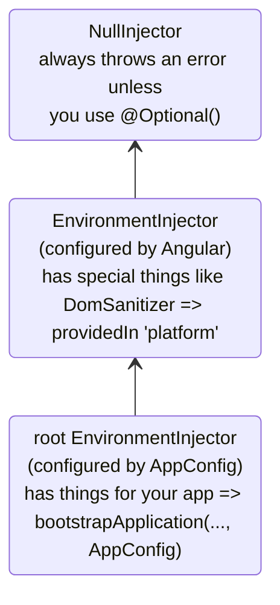
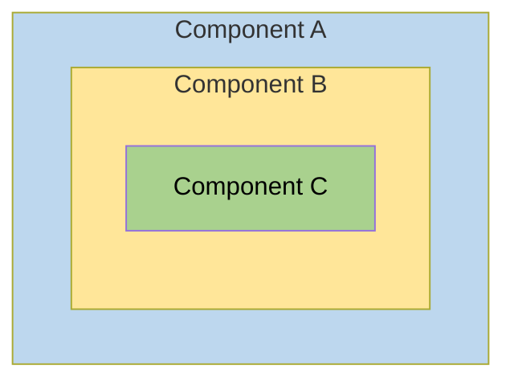
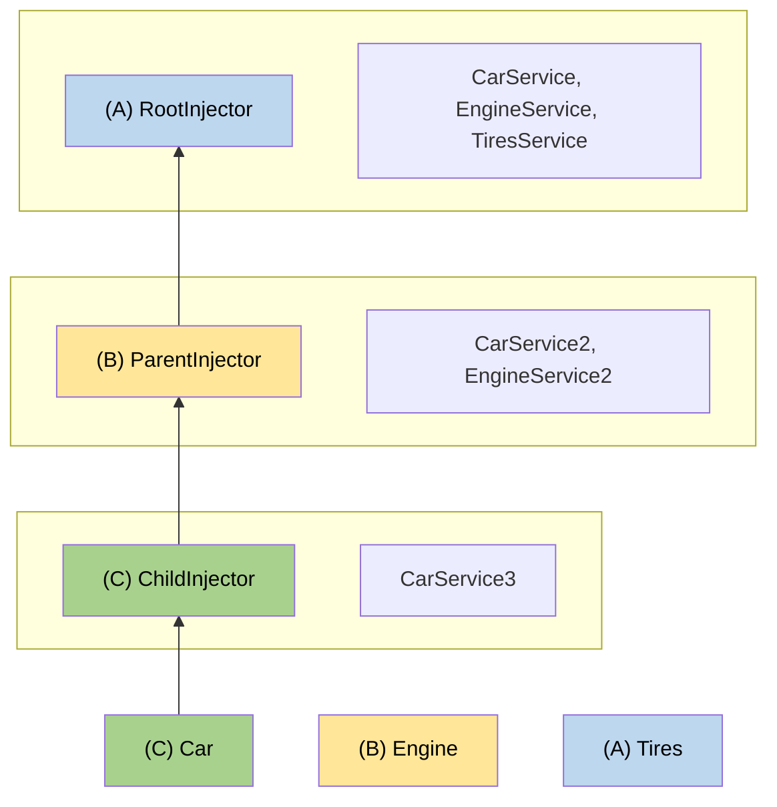

# Иерархические инжекторы

Это руководство содержит подробное описание системы иерархического внедрения зависимостей (DI) в Angular, включая правила разрешения, модификаторы и продвинутые паттерны.

NOTE: Основные понятия об иерархии инжекторов и области видимости провайдеров см. в руководстве [определение провайдеров зависимостей](guide/di/defining-dependency-providers#injector-hierarchy-in-angular).

## Типы иерархий инжекторов

В Angular существует две иерархии инжекторов:

| Иерархии инжекторов             | Подробности                                                                                                                                                                               |
| :------------------------------ | :---------------------------------------------------------------------------------------------------------------------------------------------------------------------------------------- |
| Иерархия `EnvironmentInjector`  | Настройте `EnvironmentInjector` в этой иерархии, используя `@Injectable()` или массив `providers` в `ApplicationConfig`.                                                                  |
| Иерархия `ElementInjector`      | Создается неявно для каждого DOM-элемента. По умолчанию `ElementInjector` пуст, если вы не настроите его в свойстве `providers` в декораторе `@Directive()` или `@Component()`. |

<docs-callout title="Приложения на основе NgModule">
Для приложений на основе `NgModule` вы можете предоставлять зависимости с иерархией `ModuleInjector`, используя аннотации `@NgModule()` или `@Injectable()`.
</docs-callout>

### `EnvironmentInjector`

`EnvironmentInjector` можно настроить одним из двух способов, используя:

- Свойство `providedIn` декоратора `@Injectable()` со значением `root` или `platform`.
- Массив `providers` в `ApplicationConfig`.

<docs-callout title="Tree-shaking и @Injectable()">

Использование свойства `providedIn` в `@Injectable()` предпочтительнее использования массива `providers` в `ApplicationConfig`. С помощью `@Injectable()` `providedIn` инструменты оптимизации могут выполнять Tree Shaking, удаляя сервисы, которые ваше приложение не использует. Это приводит к уменьшению размера бандла.

Tree Shaking особенно полезен для библиотек, так как приложению, использующему библиотеку, может не потребоваться внедрять все её сервисы.

</docs-callout>

`EnvironmentInjector` настраивается через `ApplicationConfig.providers`.

Предоставляйте сервисы, используя `providedIn` в `@Injectable()` следующим образом:

```ts {highlight:[4]}
import { Injectable } from '@angular/core';

@Injectable({
  providedIn: 'root' // <--provides this service in the root EnvironmentInjector
})
export class ItemService {
  name = 'telephone';
}
```

Декоратор `@Injectable()` идентифицирует класс сервиса.
Свойство `providedIn` настраивает конкретный `EnvironmentInjector`, в данном случае `root`, что делает сервис доступным в корневом `EnvironmentInjector`.

### ModuleInjector

В случае приложений на основе `NgModule`, ModuleInjector можно настроить одним из двух способов, используя:

- Свойство `providedIn` декоратора `@Injectable()` со значением `root` или `platform`.
- Массив `providers` в `@NgModule()`.

`ModuleInjector` настраивается свойствами `@NgModule.providers` и `NgModule.imports`. `ModuleInjector` представляет собой объединение всех массивов провайдеров, до которых можно добраться, рекурсивно следуя по `NgModule.imports`.

Дочерние иерархии `ModuleInjector` создаются при ленивой загрузке (lazy loading) других `@NgModule`.

### Platform injector (Инжектор платформы)

Существует еще два инжектора выше `root`: дополнительный `EnvironmentInjector` и `NullInjector()`.

Рассмотрим, как Angular запускает (bootstraps) приложение с помощью следующего кода в `main.ts`:

```ts
bootstrapApplication(AppComponent, appConfig);
```

Метод `bootstrapApplication()` создает дочерний инжектор от инжектора платформы, который настраивается экземпляром `ApplicationConfig`.
Это и есть `root` `EnvironmentInjector`.

Метод `platformBrowserDynamic()` создает инжектор, настроенный модулем `PlatformModule`, который содержит зависимости, специфичные для платформы.
Это позволяет нескольким приложениям использовать общую конфигурацию платформы.
Например, у браузера есть только одна адресная строка, независимо от того, сколько приложений запущено.
Вы можете настроить дополнительные специфичные для платформы провайдеры на уровне платформы, предоставив `extraProviders` с помощью функции `platformBrowser()`.

Следующим родительским инжектором в иерархии является `NullInjector()`, который находится на вершине дерева.
Если вы поднялись по дереву настолько высоко, что ищете сервис в `NullInjector()`, вы получите ошибку, если только не использовали `@Optional()`. В конечном итоге все заканчивается на `NullInjector()`, и он возвращает ошибку или, в случае `@Optional()`, `null`.
Для получения дополнительной информации об `@Optional()` см. раздел [`@Optional()`](#optional) этого руководства.

Следующая диаграмма отображает взаимосвязь между `root` `ModuleInjector` и его родительскими инжекторами, как описано в предыдущих абзацах.



Хотя имя `root` является специальным псевдонимом, другие иерархии `EnvironmentInjector` псевдонимов не имеют.
У вас есть возможность создавать иерархии `EnvironmentInjector` всякий раз, когда создается динамически загружаемый компонент, например, с помощью Router, который будет создавать дочерние иерархии `EnvironmentInjector`.

Все запросы перенаправляются вверх к корневому инжектору, независимо от того, настроили ли вы его с помощью экземпляра `ApplicationConfig`, переданного в метод `bootstrapApplication()`, или зарегистрировали все провайдеры с `root` в их собственных сервисах.

<docs-callout title="@Injectable() vs. ApplicationConfig">

Если вы настраиваете провайдер для всего приложения в `ApplicationConfig` метода `bootstrapApplication`, он переопределяет провайдер, настроенный для `root` в метаданных `@Injectable()`.
Вы можете использовать это для настройки нестандартного провайдера сервиса, который используется совместно несколькими приложениями.

Вот пример случая, когда конфигурация маршрутизатора компонентов включает нестандартную [стратегию локации](guide/routing#location-strategy), перечисляя ее провайдер в списке `providers` объекта `ApplicationConfig`.

```ts
providers: [
  { provide: LocationStrategy, useClass: HashLocationStrategy }
]
```

Для приложений на основе `NgModule` настраивайте провайдеры уровня приложения в `providers` модуля `AppModule`.

</docs-callout>

### `ElementInjector`

Angular создает иерархии `ElementInjector` неявно для каждого элемента DOM.

Предоставление сервиса в декораторе `@Component()` с использованием его свойства `providers` или `viewProviders` настраивает `ElementInjector`.
Например, следующий `TestComponent` настраивает `ElementInjector`, предоставляя сервис следующим образом:

```ts {highlight:[3]}
@Component({
  /* … */
  providers: [{ provide: ItemService, useValue: { name: 'lamp' } }]
})
export class TestComponent
```

HELPFUL: См. раздел [правила разрешения](#resolution-rules), чтобы понять взаимосвязь между деревом `EnvironmentInjector`, `ModuleInjector` и деревом `ElementInjector`.

Когда вы предоставляете сервисы в компоненте, этот сервис доступен через `ElementInjector` в этом экземпляре компонента.
Он также может быть виден в дочерних компонентах/директивах на основе правил видимости, описанных в разделе [правила разрешения](#resolution-rules).

Когда экземпляр компонента уничтожается, уничтожается и этот экземпляр сервиса.

#### `@Directive()` и `@Component()`

Компонент — это особый тип директивы, что означает, что так же, как у `@Directive()` есть свойство `providers`, оно есть и у `@Component()`.
Это означает, что директивы, как и компоненты, могут настраивать провайдеры, используя свойство `providers`.
Когда вы настраиваете провайдер для компонента или директивы с помощью свойства `providers`, этот провайдер принадлежит `ElementInjector` этого компонента или директивы.
Компоненты и директивы на одном и том же элементе используют общий инжектор.

## Правила разрешения {#resolution-rules}

При разрешении токена для компонента/директивы Angular выполняет это в две фазы:

1.  В иерархии `ElementInjector` (среди родителей).
2.  В иерархии `EnvironmentInjector` (среди родителей).

Когда компонент объявляет зависимость, Angular пытается удовлетворить эту зависимость с помощью собственного `ElementInjector`.
Если в инжекторе компонента отсутствует провайдер, он передает запрос вверх к `ElementInjector` родительского компонента.

Запросы продолжают передаваться вверх, пока Angular не найдет инжектор, который может обработать запрос, или пока не закончатся иерархии предков `ElementInjector`.

Если Angular не находит провайдер ни в одной из иерархий `ElementInjector`, он возвращается к элементу, где возник запрос, и ищет в иерархии `EnvironmentInjector`.
Если Angular все еще не находит провайдер, он выбрасывает ошибку.

Если вы зарегистрировали провайдер для одного и того же DI-токена на разных уровнях, Angular использует первый найденный для разрешения зависимости.
Если, например, провайдер зарегистрирован локально в компоненте, которому нужен сервис, Angular не ищет другой провайдер того же сервиса.

HELPFUL: Для приложений на основе `NgModule`, Angular будет искать в иерархии `ModuleInjector`, если не сможет найти провайдер в иерархиях `ElementInjector`.

## Модификаторы разрешения

Поведение разрешения в Angular можно изменить с помощью `optional`, `self`, `skipSelf` и `host`.
Импортируйте каждый из них из `@angular/core` и используйте в конфигурации [`inject`](/api/core/inject) при внедрении вашего сервиса.

### Типы модификаторов

Модификаторы разрешения делятся на три категории:

-   Что делать, если Angular не находит то, что вы ищете: `optional`.
-   Где начать поиск: `skipSelf`.
-   Где закончить поиск: `host` и `self`.

По умолчанию Angular всегда начинает с текущего `Injector` и продолжает поиск вверх до самого конца.
Модификаторы позволяют изменить начальное (или _self_) местоположение и конечное местоположение.

Кроме того, вы можете комбинировать все модификаторы, кроме:

-   `host` и `self`
-   `skipSelf` и `self`.

### `optional` {#optional}

`optional` позволяет Angular считать внедряемый сервис необязательным.
Таким образом, если он не может быть разрешен во время выполнения, Angular разрешает сервис как `null`, вместо того чтобы выбрасывать ошибку.
В следующем примере сервис `OptionalService` не предоставлен ни в сервисе, ни в `ApplicationConfig`, ни в `@NgModule()`, ни в классе компонента, поэтому он недоступен нигде в приложении.

```ts {header:"src/app/optional/optional.component.ts"}
export class OptionalComponent {
  public optional? = inject(OptionalService, {optional: true});
}
```

### `self`

Используйте `self`, чтобы Angular искал только в `ElementInjector` текущего компонента или директивы.

Хороший вариант использования `self` — внедрить сервис, но только если он доступен на текущем хост-элементе.
Чтобы избежать ошибок в этой ситуации, комбинируйте `self` с `optional`.

Например, в следующем `SelfNoDataComponent` обратите внимание на внедренный `LeafService` как свойство.

```ts {header: 'self-no-data.component.ts', highlight: [7]}
@Component({
  selector: 'app-self-no-data',
  templateUrl: './self-no-data.component.html',
  styleUrls: ['./self-no-data.component.css']
})
export class SelfNoDataComponent {
  public leaf = inject(LeafService, {optional: true, self: true});
}
```

В этом примере существует родительский провайдер, и внедрение сервиса вернуло бы значение, однако внедрение сервиса с `self` и `optional` вернет `null`, потому что `self` указывает инжектору прекратить поиск на текущем хост-элементе.

Другой пример показывает класс компонента с провайдером для `FlowerService`.
В этом случае инжектор не ищет дальше текущего `ElementInjector`, так как находит `FlowerService` и возвращает тюльпан 🌷.

```ts {header:"src/app/self/self.component.ts"}
@Component({
  selector: 'app-self',
  templateUrl: './self.component.html',
  styleUrls: ['./self.component.css'],
  providers: [{provide: FlowerService, useValue: {emoji: '🌷'}}],
})
export class SelfComponent {
  constructor(@Self() public flower: FlowerService) {}
}
```

### `skipSelf`

`skipSelf` — это противоположность `self`.
С `skipSelf` Angular начинает поиск сервиса в родительском `ElementInjector`, а не в текущем.
Так что, если родительский `ElementInjector` использует значение папоротника <code>🌿</code> для `emoji`, но у вас есть кленовый лист <code>🍁</code> в массиве `providers` компонента, Angular проигнорирует кленовый лист <code>🍁</code> и использует папоротник <code>🌿</code>.

Чтобы увидеть это в коде, предположим, что следующее значение для `emoji` — это то, что использовал родительский компонент, как в этом сервисе:

```ts {header: 'leaf.service.ts'}
export class LeafService {
  emoji = '🌿';
}
```

Представьте, что в дочернем компоненте у вас другое значение — кленовый лист 🍁, но вы хотите использовать значение родителя.
Именно тогда вы используете `skipSelf`:

```ts {header:"skipself.component.ts" highlight:[[6],[10]]}
@Component({
  selector: 'app-skipself',
  templateUrl: './skipself.component.html',
  styleUrls: ['./skipself.component.css'],
  // Angular would ignore this LeafService instance
  providers: [{ provide: LeafService, useValue: { emoji: '🍁' } }]
})
export class SkipselfComponent {
  // Use skipSelf as inject option
  public leaf = inject(LeafService, {skipSelf: true});
}
```

В этом случае значение, которое вы получите для `emoji`, будет папоротник <code>🌿</code>, а не кленовый лист <code>🍁</code>.

#### Опция `skipSelf` с `optional`

Используйте опцию `skipSelf` вместе с `optional`, чтобы предотвратить ошибку, если значение равно `null`.

В следующем примере сервис `Person` внедряется во время инициализации свойства.
`skipSelf` говорит Angular пропустить текущий инжектор, а `optional` предотвратит ошибку, если сервис `Person` окажется `null`.

```ts
class Person {
  parent = inject(Person, {optional: true, skipSelf: true})
}
```

### `host`

<!-- TODO: Remove ambiguity between host and self. -->

`host` позволяет вам обозначить компонент как последнюю остановку в дереве инжекторов при поиске провайдеров.

Даже если экземпляр сервиса существует выше по дереву, Angular не продолжит поиск.
Используйте `host` следующим образом:

```ts {header:"host.component.ts" highlight:[[6],[9]]}
@Component({
  selector: 'app-host',
  templateUrl: './host.component.html',
  styleUrls: ['./host.component.css'],
  // provide the service
  providers: [{provide: FlowerService, useValue: {emoji: '🌷'}}],
})
export class HostComponent {
  // use host when injecting the service
  flower = inject(FlowerService, {host: true, optional: true});
}
```

Поскольку `HostComponent` имеет опцию `host`, независимо от того, какое значение `flower.emoji` может быть у родителя `HostComponent`, `HostComponent` будет использовать тюльпан <code>🌷</code>.

### Модификаторы при внедрении через конструктор

Аналогично представленному выше, поведение внедрения через конструктор можно изменить с помощью `@Optional()`, `@Self()`, `@SkipSelf()` и `@Host()`.

Импортируйте каждый из них из `@angular/core` и используйте в конструкторе класса компонента при внедрении вашего сервиса.

```ts {header:"self-no-data.component.ts" highlight:[2]}
export class SelfNoDataComponent {
  constructor(@Self() @Optional() public leaf?: LeafService) { }
}
```

## Логическая структура шаблона

Когда вы предоставляете сервисы в классе компонента, они видны в дереве `ElementInjector` относительно того, где и как вы предоставляете эти сервисы.

Понимание базовой логической структуры шаблона Angular даст вам основу для настройки сервисов и, в свою очередь, управления их видимостью.

Компоненты используются в ваших шаблонах, как в следующем примере:

```html
<app-root>
  <app-child />;
</app-root>
```

HELPFUL: Обычно вы объявляете компоненты и их шаблоны в отдельных файлах.
Для понимания того, как работает система внедрения, полезно рассматривать их с точки зрения объединенного логического дерева.
Термин _логическое_ отличает его от дерева рендеринга, которое является DOM-деревом вашего приложения.
Чтобы отметить места расположения шаблонов компонентов, в этом руководстве используется псевдоэлемент `<#VIEW>`, который на самом деле не существует в дереве рендеринга и присутствует только для целей ментальной модели.

Ниже приведен пример того, как деревья представлений `<app-root>` и `<app-child>` объединяются в единое логическое дерево:

```html
<app-root>
  <#VIEW>
    <app-child>
     <#VIEW>
       …content goes here…
     </#VIEW>
    </app-child>
  </#VIEW>
</app-root>
```

Понимание идеи разграничения `<#VIEW>` особенно важно при настройке сервисов в классе компонента.

## Пример: Предоставление сервисов в `@Component()`

То, как вы предоставляете сервисы с помощью декоратора `@Component()` (или `@Directive()`), определяет их видимость.
В следующих разделах демонстрируются `providers` и `viewProviders` вместе со способами изменения видимости сервиса с помощью `skipSelf` и `host`.

Класс компонента может предоставлять сервисы двумя способами:

| Массивы                      | Подробности                                    |
| :--------------------------- | :--------------------------------------------- |
| С массивом `providers`       | `@Component({ providers: [SomeService] })`     |
| С массивом `viewProviders`   | `@Component({ viewProviders: [SomeService] })` |

В примерах ниже вы увидите логическое дерево приложения Angular.
Чтобы проиллюстрировать, как работает инжектор в контексте шаблонов, логическое дерево будет представлять HTML-структуру приложения.
Например, логическое дерево покажет, что `<child-component>` является прямым потомком `<parent-component>`.

В логическом дереве вы увидите специальные атрибуты: `@Provide`, `@Inject` и `@ApplicationConfig`.
Это не настоящие атрибуты, они здесь для демонстрации того, что происходит «под капотом».

| Атрибут сервиса Angular   | Подробности                                                                                             |
| :------------------------ | :------------------------------------------------------------------------------------------------------ |
| `@Inject(Token)=>Value`   | Если `Token` внедряется в этом месте логического дерева, его значением будет `Value`.                   |
| `@Provide(Token=Value)`   | Указывает, что `Token` предоставляется со значением `Value` в этом месте логического дерева.            |
| `@ApplicationConfig`      | Демонстрирует, что в этом месте должен использоваться резервный (fallback) `EnvironmentInjector`.       |

### Структура примера приложения

В примере приложения есть `FlowerService`, предоставленный в `root` со значением `emoji` красный гибискус <code>🌺</code>.

```ts {header:"lower.service.ts"}
@Injectable({
  providedIn: 'root'
})
export class FlowerService {
  emoji = '🌺';
}
```

Рассмотрим приложение только с `AppComponent` и `ChildComponent`.
Самое базовое отрендеренное представление будет выглядеть как вложенные HTML-элементы, например:

```html
<app-root> <!-- AppComponent selector -->
<app-child> <!-- ChildComponent selector -->
</app-child>
</app-root>
```

Однако за кулисами Angular использует логическое представление вида, как показано ниже, при разрешении запросов на внедрение:

```html
<app-root> <!-- AppComponent selector -->
  <#VIEW>
    <app-child> <!-- ChildComponent selector -->
      <#VIEW>
      </#VIEW>
    </app-child>
  </#VIEW>
</app-root>
```

`<#VIEW>` здесь представляет экземпляр шаблона.
Обратите внимание, что у каждого компонента есть свой `<#VIEW>`.

Знание этой структуры может помочь вам понять, как предоставлять и внедрять ваши сервисы, и дать вам полный контроль над видимостью сервисов.

Теперь предположим, что `<app-root>` внедряет `FlowerService`:

```typescript
export class AppComponent  {
  flower = inject(FlowerService);
}
```

Добавьте привязку (binding) к шаблону `<app-root>`, чтобы визуализировать результат:

```html
<p>Emoji from FlowerService: {{flower.emoji}}</p>
```

Вывод в представлении будет таким:

```shell
Emoji from FlowerService: 🌺
```

В логическом дереве это будет представлено следующим образом:

```html
<app-root @ApplicationConfig
        @Inject(FlowerService) flower=>"🌺">
  <#VIEW>
    <p>Emoji from FlowerService: {{flower.emoji}} (🌺)</p>
    <app-child>
      <#VIEW>
      </#VIEW>
    </app-child>
  </#VIEW>
</app-root>
```

Когда `<app-root>` запрашивает `FlowerService`, задача инжектора — разрешить токен `FlowerService`.
Разрешение токена происходит в две фазы:

1.  Инжектор определяет начальное местоположение в логическом дереве и конечное местоположение поиска.
    Инжектор начинает с начального местоположения и ищет токен на каждом уровне представления в логическом дереве.
    Если токен найден, он возвращается.

2.  Если токен не найден, инжектор ищет ближайший родительский `EnvironmentInjector`, чтобы делегировать запрос ему.

В примере ограничения таковы:

1.  Начать с `<#VIEW>`, принадлежащего `<app-root>`, и закончить на `<app-root>`.
    - Обычно начальная точка поиска находится в точке внедрения.
      Однако в данном случае `<app-root>` является компонентом. Компоненты (`@Component`) особенные тем, что они также включают свои собственные `viewProviders`, поэтому поиск начинается с `<#VIEW>`, принадлежащего `<app-root>`.
      Это не относилось бы к директиве, сопоставленной в том же месте.
    - Конечное местоположение совпадает с самим компонентом, потому что это самый верхний компонент в этом приложении.

2.  `EnvironmentInjector`, предоставленный `ApplicationConfig`, действует как резервный инжектор, когда токен внедрения не может быть найден в иерархиях `ElementInjector`.

### Использование массива `providers`

Теперь в классе `ChildComponent` добавьте провайдер для `FlowerService`, чтобы продемонстрировать более сложные правила разрешения в следующих разделах:

```ts
@Component({
  selector: 'app-child',
  templateUrl: './child.component.html',
  styleUrls: ['./child.component.css'],
  // use the providers array to provide a service
  providers: [{provide: FlowerService, useValue: {emoji: '🌻'}}],
})
export class ChildComponent {
  // inject the service
  flower = inject(FlowerService);
}
```

Теперь, когда `FlowerService` предоставлен в декораторе `@Component()`, когда `<app-child>` запрашивает сервис, инжектору нужно искать только до `ElementInjector` в `<app-child>`.
Ему не придется продолжать поиск дальше по дереву инжекторов.

Следующий шаг — добавить привязку к шаблону `ChildComponent`.

```html
<p>Emoji from FlowerService: {{flower.emoji}}</p>
```

Чтобы отобразить новые значения, добавьте `<app-child>` в нижнюю часть шаблона `AppComponent`, чтобы представление также отображало подсолнух:

```shell
Child Component
Emoji from FlowerService: 🌻
```

В логическом дереве это представлено следующим образом:

```html
<app-root @ApplicationConfig
          @Inject(FlowerService) flower=>"🌺">
  <#VIEW>

  <p>Emoji from FlowerService: {{flower.emoji}} (🌺)</p>
  <app-child @Provide(FlowerService="🌻" )
             @Inject(FlowerService)=>"🌻"> <!-- search ends here -->
    <#VIEW> <!-- search starts here -->
    <h2>Child Component</h2>
    <p>Emoji from FlowerService: {{flower.emoji}} (🌻)</p>
  </
  #VIEW>
  </app-child>
</#VIEW>
</app-root>
```

Когда `<app-child>` запрашивает `FlowerService`, инжектор начинает поиск с `<#VIEW>`, принадлежащего `<app-child>` ( `<#VIEW>` включен, потому что внедрение происходит из `@Component()`), и заканчивает на `<app-child>`.
В этом случае `FlowerService` разрешается в массиве `providers` с подсолнухом <code>🌻</code> из `<app-child>`.
Инжектору не нужно искать дальше в дереве инжекторов.
Он останавливается, как только находит `FlowerService`, и никогда не видит красный гибискус <code>🌺</code>.

### Использование массива `viewProviders`

Используйте массив `viewProviders` как еще один способ предоставления сервисов в декораторе `@Component()`.
Использование `viewProviders` делает сервисы видимыми в `<#VIEW>`.

HELPFUL: Шаги те же, что и при использовании массива `providers`, за исключением использования массива `viewProviders`.

Для пошаговых инструкций продолжайте чтение этого раздела.
Если вы можете настроить это самостоятельно, перейдите к разделу [Изменение доступности сервиса](#visibility-of-provided-tokens).

Для демонстрации мы создадим `AnimalService`, чтобы показать работу `viewProviders`.
Сначала создайте `AnimalService` со свойством `emoji` кит <code>🐳</code>:

```typescript
import {Injectable} from '@angular/core';

@Injectable({
  providedIn: 'root',
})
export class AnimalService {
  emoji = '🐳';
}
```

Следуя тому же шаблону, что и с `FlowerService`, внедрите `AnimalService` в класс `AppComponent`:

```ts
export class AppComponent {
  public flower = inject(FlowerService);
  public animal = inject(AnimalService);
}
```

HELPFUL: Вы можете оставить весь код, связанный с `FlowerService`, на месте, так как это позволит сравнить его с `AnimalService`.

Добавьте массив `viewProviders` и внедрите `AnimalService` также в класс `<app-child>`, но дайте `emoji` другое значение.
Здесь он имеет значение собаки 🐶.

```typescript
@Component({
  selector: 'app-child',
  templateUrl: './child.component.html',
  styleUrls: ['./child.component.css'],
  // provide services
  providers: [{provide: FlowerService, useValue: {emoji: '🌻'}}],
  viewProviders: [{provide: AnimalService, useValue: {emoji: '🐶'}}],
})
export class ChildComponent {
  // inject services
  flower = inject(FlowerService);
  animal = inject(AnimalService);
}
```

Добавьте привязки к шаблонам `ChildComponent` и `AppComponent`.
В шаблон `ChildComponent` добавьте следующую привязку:

```html
<p>Emoji from AnimalService: {{animal.emoji}}</p>
```

Дополнительно добавьте то же самое в шаблон `AppComponent`:

```html
<p>Emoji from AnimalService: {{animal.emoji}}</p>s
```

Теперь вы должны увидеть оба значения в браузере:

```shell
AppComponent
Emoji from AnimalService: 🐳

Child Component
Emoji from AnimalService: 🐶
```

Логическое дерево для этого примера `viewProviders` выглядит следующим образом:

```html
<app-root @ApplicationConfig
          @Inject(AnimalService) animal=>"🐳">
  <#VIEW>
  <app-child>
    <#VIEW @Provide(AnimalService="🐶")
    @Inject(AnimalService=>"🐶")>

    <!-- ^^using viewProviders means AnimalService is available in <#VIEW>-->
    <p>Emoji from AnimalService: {{animal.emoji}} (🐶)</p>
  </
  #VIEW>
  </app-child>
</#VIEW>
</app-root>
```

Так же, как и в примере с `FlowerService`, `AnimalService` предоставляется в декораторе `@Component()` компонента `<app-child>`.
Это означает, что, поскольку инжектор сначала ищет в `ElementInjector` компонента, он находит значение `AnimalService` — собаку <code>🐶</code>.
Ему не нужно продолжать поиск по дереву `ElementInjector`, а также не нужно искать в `ModuleInjector`.

### `providers` vs. `viewProviders`

Поле `viewProviders` концептуально похоже на `providers`, но есть одно заметное отличие.
Провайдеры, настроенные в `viewProviders`, не видны проецируемому контенту, который в конечном итоге становится логическим потомком компонента.

Чтобы увидеть разницу между использованием `providers` и `viewProviders`, добавьте еще один компонент в пример и назовите его `InspectorComponent`.
`InspectorComponent` будет дочерним элементом `ChildComponent`.
В `inspector.component.ts` внедрите `FlowerService` и `AnimalService` во время инициализации свойств:

```typescript
export class InspectorComponent {
  flower = inject(FlowerService);
  animal = inject(AnimalService);
}
```

Вам не нужен массив `providers` или `viewProviders`.
Далее, в `inspector.component.html`, добавьте ту же разметку из предыдущих компонентов:

```html
<p>Emoji from FlowerService: {{flower.emoji}}</p>
<p>Emoji from AnimalService: {{animal.emoji}}</p>
```

Не забудьте добавить `InspectorComponent` в массив `imports` компонента `ChildComponent`.

```ts
@Component({
  ...
  imports: [InspectorComponent]
})
```

Затем добавьте следующее в `child.component.html`:

```html
...

<div class="container">
  <h3>Content projection</h3>
  <ng-content />
</div>
<h3>Inside the view</h3>

<app-inspector />
```

`<ng-content>` позволяет вам проецировать контент, а `<app-inspector>` внутри шаблона `ChildComponent` делает `InspectorComponent` дочерним компонентом `ChildComponent`.

Далее добавьте следующее в `app.component.html`, чтобы воспользоваться проекцией контента.

```html
<app-child>
  <app-inspector />
</app-child>
```

Браузер теперь отображает следующее (опуская предыдущие примеры для краткости):

```shell
...
Content projection

Emoji from FlowerService: 🌻
Emoji from AnimalService: 🐳

Emoji from FlowerService: 🌻
Emoji from AnimalService: 🐶
```

Эти четыре привязки демонстрируют разницу между `providers` и `viewProviders`.
Помните, что эмодзи собаки <code>🐶</code> объявлено внутри `<#VIEW>` компонента `ChildComponent` и не видно проецируемому контенту.
Вместо этого проецируемый контент видит кита <code>🐳</code>.

Однако в следующем разделе вывода, хотя `InspectorComponent` является фактическим дочерним компонентом `ChildComponent`, `InspectorComponent` находится внутри `<#VIEW>`, поэтому, когда он запрашивает `AnimalService`, он видит собаку <code>🐶</code>.

`AnimalService` в логическом дереве будет выглядеть так:

```html
<app-root @ApplicationConfig
          @Inject(AnimalService) animal=>"🐳">
  <#VIEW>
  <app-child>
    <#VIEW @Provide(AnimalService="🐶")
    @Inject(AnimalService=>"🐶")>

    <!-- ^^using viewProviders means AnimalService is available in <#VIEW>-->
    <p>Emoji from AnimalService: {{animal.emoji}} (🐶)</p>

    <div class="container">
      <h3>Content projection</h3>
      <app-inspector @Inject(AnimalService) animal=>"🐳">
        <p>Emoji from AnimalService: {{animal.emoji}} (🐳)</p>
      </app-inspector>
    </div>

    <app-inspector>
      <#VIEW @Inject(AnimalService) animal=>"🐶">
      <p>Emoji from AnimalService: {{animal.emoji}} (🐶)</p>
    </
    #VIEW>
    </app-inspector>
  </
  #VIEW>
  </app-child>

</#VIEW>
</app-root>
```

Проецируемый контент `<app-inspector>` видит кита <code>🐳</code>, а не собаку <code>🐶</code>, потому что собака <code>🐶</code> находится внутри `<#VIEW>` компонента `<app-child>`.
`<app-inspector>` может видеть собаку <code>🐶</code> только если он также находится внутри `<#VIEW>`.

### Видимость предоставленных токенов {#visibility-of-provided-tokens}

Декораторы видимости влияют на то, где начинается и заканчивается поиск токена внедрения в логическом дереве.
Для этого поместите конфигурацию видимости в точку внедрения, то есть при вызове `inject()`, а не в точку объявления.

Чтобы изменить место, где инжектор начинает искать `FlowerService`, добавьте `skipSelf` в вызов `inject()` в `<app-child>`, где внедряется `FlowerService`.
Этот вызов является инициализатором свойства в `<app-child>`, как показано в `child.component.ts`:

```typescript
  flower = inject(FlowerService, { skipSelf: true })
```

С `skipSelf` инжектор `<app-child>` не ищет `FlowerService` у себя.
Вместо этого инжектор начинает искать `FlowerService` в `ElementInjector` компонента `<app-root>`, где ничего не находит.
Затем он возвращается к `ModuleInjector` компонента `<app-child>` и находит значение красного гибискуса <code>🌺</code>, которое доступно, потому что `<app-child>` и `<app-root>` используют один и тот же `ModuleInjector`.
UI отображает следующее:

```shell
Emoji from FlowerService: 🌺
```

В логическом дереве эта же идея может выглядеть так:

```html
<app-root @ApplicationConfig
          @Inject(FlowerService) flower=>"🌺">
  <#VIEW>
  <app-child @Provide(FlowerService="🌻" )>
    <#VIEW @Inject(FlowerService, SkipSelf)=>"🌺">

    <!-- With SkipSelf, the injector looks to the next injector up the tree (app-root) -->

  </
  #VIEW>
  </app-child>
</#VIEW>
</app-root>
```

Хотя `<app-child>` предоставляет подсолнух <code>🌻</code>, приложение отображает красный гибискус <code>🌺</code>, потому что `skipSelf` заставляет текущий инжектор (`app-child`) пропустить себя и искать у родителя.

Если теперь добавить `host` (в дополнение к `skipSelf`), результатом будет `null`.
Это потому, что `host` ограничивает верхнюю границу поиска до `<#VIEW>` компонента `app-child`.
Вот идея в логическом дереве:

```html
<app-root @ApplicationConfig
          @Inject(FlowerService) flower=>"🌺">
  <#VIEW> <!-- end search here with null-->
  <app-child @Provide(FlowerService="🌻" )> <!-- start search here -->
    <#VIEW inject(FlowerService, {skipSelf: true, host: true, optional:true})=>null>
  </
  #VIEW>
  </app-parent>
</#VIEW>
</app-root>
```

Здесь сервисы и их значения те же, но `host` останавливает инжектор от поиска `FlowerService` дальше, чем `<#VIEW>`, поэтому он не находит его и возвращает `null`.

### `skipSelf` и `viewProviders`

Помните, `<app-child>` предоставляет `AnimalService` в массиве `viewProviders` со значением собаки <code>🐶</code>.
Поскольку инжектору нужно искать `AnimalService` только в `ElementInjector` компонента `<app-child>`, он никогда не видит кита <code>🐳</code>.

Как и в примере с `FlowerService`, если вы добавите `skipSelf` в `inject()` для `AnimalService`, инжектор не будет искать `AnimalService` в `ElementInjector` текущего `<app-child>`.
Вместо этого инжектор начнет с `ElementInjector` компонента `<app-root>`.

```typescript
@Component({
  selector: 'app-child',
  …
  viewProviders: [
    { provide: AnimalService, useValue: { emoji: '🐶' } },
  ],
})
```

Логическое дерево выглядит так с `skipSelf` в `<app-child>`:

```html
<app-root @ApplicationConfig
          @Inject(AnimalService=>"🐳")>
  <#VIEW><!-- search begins here -->
  <app-child>
    <#VIEW @Provide(AnimalService="🐶")
    @Inject(AnimalService, SkipSelf=>"🐳")>

    <!--Add skipSelf -->

  </
  #VIEW>
  </app-child>
</#VIEW>
</app-root>
```

С `skipSelf` в `<app-child>` инжектор начинает поиск `AnimalService` в `ElementInjector` компонента `<app-root>` и находит кита 🐳.

### `host` и `viewProviders`

Если вы просто используете `host` для внедрения `AnimalService`, результатом будет собака <code>🐶</code>, потому что инжектор находит `AnimalService` в самом `<#VIEW>` компонента `<app-child>`.
`ChildComponent` настраивает `viewProviders` так, что эмодзи собаки предоставляется как значение `AnimalService`.
Вы также можете видеть `host` в `inject()`:

```typescript
@Component({
  selector: 'app-child',
  …
  viewProviders: [
    { provide: AnimalService, useValue: { emoji: '🐶' } },
  ]
})
export class ChildComponent {
  animal = inject(AnimalService, { host: true })
}
```

`host: true` заставляет инжектор искать, пока он не встретит границу `<#VIEW>`.

```html
<app-root @ApplicationConfig
          @Inject(AnimalService=>"🐳")>
  <#VIEW>
  <app-child>
    <#VIEW @Provide(AnimalService="🐶")
    inject(AnimalService, {host: true}=>"🐶")> <!-- host stops search here -->
  </
  #VIEW>
  </app-child>
</#VIEW>
</app-root>
```

Добавьте массив `viewProviders` с третьим животным, ежом <code>🦔</code>, в метаданные `@Component()` файла `app.component.ts`:

```typescript
@Component({
  selector: 'app-root',
  templateUrl: './app.component.html',
  styleUrls: [ './app.component.css' ],
  viewProviders: [
    { provide: AnimalService, useValue: { emoji: '🦔' } },
  ],
})
```

Затем добавьте `skipSelf` вместе с `host` в `inject()` для внедрения `AnimalService` в `child.component.ts`.
Вот `host` и `skipSelf` в инициализации свойства `animal`:

```typescript
export class ChildComponent {
  animal = inject(AnimalService, { host: true, skipSelf: true });
}
```

<!-- TODO: This requires a rework. It seems not well explained what `viewProviders`/`injectors` is here
  and how `host` works.
 -->

Когда `host` и `skipSelf` применялись к `FlowerService`, который находится в массиве `providers`, результатом был `null`, потому что `skipSelf` начинает поиск в инжекторе `<app-child>`, но `host` останавливает поиск на `<#VIEW>` — где нет `FlowerService`.
В логическом дереве вы можете видеть, что `FlowerService` виден в `<app-child>`, а не в его `<#VIEW>`.

Однако `AnimalService`, который предоставляется в массиве `viewProviders` компонента `AppComponent`, виден.

Представление логического дерева показывает, почему это так:

```html
<app-root @ApplicationConfig
          @Inject(AnimalService=>"🐳")>
  <#VIEW @Provide(AnimalService="🦔")
  @Inject(AnimalService, @Optional)=>"🦔">

  <!-- ^^skipSelf starts here,  host stops here^^ -->
  <app-child>
    <#VIEW @Provide(AnimalService="🐶")
    inject(AnimalService, {skipSelf:true, host: true, optional: true})=>"🦔">
    <!-- Add skipSelf ^^-->
  </
  #VIEW>
  </app-child>
</#VIEW>
</app-root>
```

`skipSelf` заставляет инжектор начать поиск `AnimalService` в `<app-root>`, а не в `<app-child>`, где возникает запрос, а `host` останавливает поиск на `<#VIEW>` компонента `<app-root>`.
Поскольку `AnimalService` предоставляется через массив `viewProviders`, инжектор находит ежа <code>🦔</code> в `<#VIEW>`.

## Пример: Варианты использования `ElementInjector`

Возможность настраивать один или несколько провайдеров на разных уровнях открывает полезные возможности.

### Сценарий: изоляция сервиса

Архитектурные причины могут привести вас к ограничению доступа к сервису доменом приложения, которому он принадлежит.
Например, предположим, мы создаем `VillainsListComponent`, который отображает список злодеев.
Он получает этих злодеев из `VillainsService`.

Если вы предоставите `VillainsService` в корневом `AppModule`, это сделает `VillainsService` видимым везде в приложении.
Если вы позже измените `VillainsService`, вы можете сломать что-то в других компонентах, которые случайно начали зависеть от этого сервиса.

Вместо этого вам следует предоставить `VillainsService` в метаданных `providers` компонента `VillainsListComponent` следующим образом:

```typescript
@Component({
  selector: 'app-villains-list',
  templateUrl: './villains-list.component.html',
  providers: [VillainsService],
})
export class VillainsListComponent {}
```

Предоставляя `VillainsService` в метаданных `VillainsListComponent` и нигде больше, сервис становится доступным только в `VillainsListComponent` и его дереве подкомпонентов.

`VillainService` является синглтоном по отношению к `VillainsListComponent`, потому что именно там он объявлен.
Пока `VillainsListComponent` не будет уничтожен, это будет один и тот же экземпляр `VillainService`, но если существует несколько экземпляров `VillainsListComponent`, то у каждого экземпляра `VillainsListComponent` будет свой собственный экземпляр `VillainService`.

### Сценарий: несколько сеансов редактирования

Многие приложения позволяют пользователям работать над несколькими открытыми задачами одновременно.
Например, в приложении для подготовки налогов составитель может работать над несколькими налоговыми декларациями, переключаясь с одной на другую в течение дня.

Чтобы продемонстрировать этот сценарий, представьте `HeroListComponent`, который отображает список супергероев.

Чтобы открыть налоговую декларацию героя, составитель нажимает на имя героя, что открывает компонент для редактирования этой декларации.
Каждая выбранная налоговая декларация героя открывается в своем собственном компоненте, и несколько деклараций могут быть открыты одновременно.

Каждый компонент налоговой декларации имеет следующие характеристики:

-   Является собственным сеансом редактирования налоговой декларации.
-   Может изменять налоговую декларацию, не затрагивая декларацию в другом компоненте.
-   Имеет возможность сохранить изменения в своей налоговой декларации или отменить их.

Предположим, что `HeroTaxReturnComponent` имеет логику для управления и восстановления изменений.
Это было бы простой задачей для налоговой декларации героя.
В реальном мире, с богатой моделью данных налоговой декларации, управление изменениями было бы сложным.
Вы могли бы делегировать это управление вспомогательному сервису, как это делает данный пример.

`HeroTaxReturnService` кэширует одну `HeroTaxReturn`, отслеживает изменения в этой декларации и может сохранить или восстановить ее.
Он также делегирует задачи общему для всего приложения синглтону `HeroService`, который он получает через внедрение.

```typescript
import {inject, Injectable} from '@angular/core';
import {HeroTaxReturn} from './hero';
import {HeroesService} from './heroes.service';

@Injectable()
export class HeroTaxReturnService {
  private currentTaxReturn!: HeroTaxReturn;
  private originalTaxReturn!: HeroTaxReturn;

  private heroService = inject(HeroesService);

  set taxReturn(htr: HeroTaxReturn) {
    this.originalTaxReturn = htr;
    this.currentTaxReturn = htr.clone();
  }

  get taxReturn(): HeroTaxReturn {
    return this.currentTaxReturn;
  }

  restoreTaxReturn() {
    this.taxReturn = this.originalTaxReturn;
  }

  saveTaxReturn() {
    this.taxReturn = this.currentTaxReturn;
    this.heroService.saveTaxReturn(this.currentTaxReturn).subscribe();
  }
}
```

Вот `HeroTaxReturnComponent`, который использует `HeroTaxReturnService`.

```typescript
import {Component, input, output} from '@angular/core';
import {HeroTaxReturn} from './hero';
import {HeroTaxReturnService} from './hero-tax-return.service';

@Component({
  selector: 'app-hero-tax-return',
  templateUrl: './hero-tax-return.component.html',
  styleUrls: ['./hero-tax-return.component.css'],
  providers: [HeroTaxReturnService],
})
export class HeroTaxReturnComponent {
  message = '';

  close = output<void>();

  get taxReturn(): HeroTaxReturn {
    return this.heroTaxReturnService.taxReturn;
  }

  taxReturn = input.required<HeroTaxReturn>();

  constructor() {
    effect(() => {
      this.heroTaxReturnService.taxReturn = this.taxReturn();
    });
  }

  private heroTaxReturnService = inject(HeroTaxReturnService);

  onCanceled() {
    this.flashMessage('Canceled');
    this.heroTaxReturnService.restoreTaxReturn();
  }

  onClose() {
    this.close.emit();
  }

  onSaved() {
    this.flashMessage('Saved');
    this.heroTaxReturnService.saveTaxReturn();
  }

  flashMessage(msg: string) {
    this.message = msg;
    setTimeout(() => (this.message = ''), 500);
  }
}
```

_Налоговая декларация для редактирования_ поступает через свойство `input`, которое реализовано с помощью геттеров и сеттеров.
Сеттер инициализирует собственный экземпляр `HeroTaxReturnService` компонента входящей декларацией.
Геттер всегда возвращает то, что сервис считает текущим состоянием героя.
Компонент также просит сервис сохранить и восстановить эту налоговую декларацию.

Это не сработает, если сервис будет синглтоном для всего приложения.
Все компоненты будут использовать один и тот же экземпляр сервиса, и каждый компонент будет перезаписывать налоговую декларацию, принадлежащую другому герою.

Чтобы предотвратить это, настройте инжектор уровня компонента `HeroTaxReturnComponent` для предоставления сервиса, используя свойство `providers` в метаданных компонента.

```typescript
  providers: [HeroTaxReturnService]
```

`HeroTaxReturnComponent` имеет свой собственный провайдер `HeroTaxReturnService`.
Напомним, что каждый _экземпляр_ компонента имеет свой собственный инжектор.
Предоставление сервиса на уровне компонента гарантирует, что _каждый_ экземпляр компонента получает частный экземпляр сервиса. Это гарантирует, что ни одна налоговая декларация не будет перезаписана.

HELPFUL: Остальная часть кода сценария опирается на другие функции и техники Angular, о которых вы можете узнать в других разделах документации.

### Сценарий: специализированные провайдеры

Еще одна причина предоставить сервис снова на другом уровне — заменить его _более специализированной_ реализацией глубже в дереве компонентов.

Например, рассмотрим компонент `Car`, который включает информацию о шинном сервисе и зависит от других сервисов для предоставления более подробной информации об автомобиле.

Корневой инжектор, обозначенный как (A), использует _общие_ провайдеры для деталей о `CarService` и `EngineService`.

1.  Компонент `Car` (A). Компонент (A) отображает данные о шинном сервисе автомобиля и указывает общие сервисы для предоставления дополнительной информации об автомобиле.

2.  Дочерний компонент (B). Компонент (B) определяет свои собственные, _специализированные_ провайдеры для `CarService` и `EngineService`, которые имеют особые возможности, подходящие для того, что происходит в компоненте (B).

3.  Дочерний компонент (C) как потомок компонента (B). Компонент (C) определяет свой собственный, еще _более специализированный_ провайдер для `CarService`.



За кулисами каждый компонент настраивает свой собственный инжектор с нулем, одним или несколькими провайдерами, определенными для этого самого компонента.

Когда вы разрешаете экземпляр `Car` в самом глубоком компоненте (C), его инжектор создает:

-   Экземпляр `Car`, разрешенный инжектором (C).
-   `Engine`, разрешенный инжектором (B).
-   Его `Tires`, разрешенные корневым инжектором (A).



## Дополнительно о внедрении зависимостей

<docs-pill-row>
  <docs-pill href="/guide/di/dependency-injection-providers" title="DI Providers"/>
</docs-pill-row>