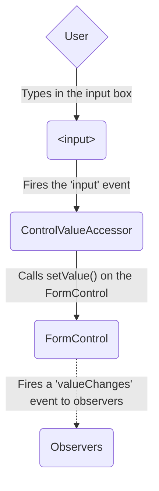
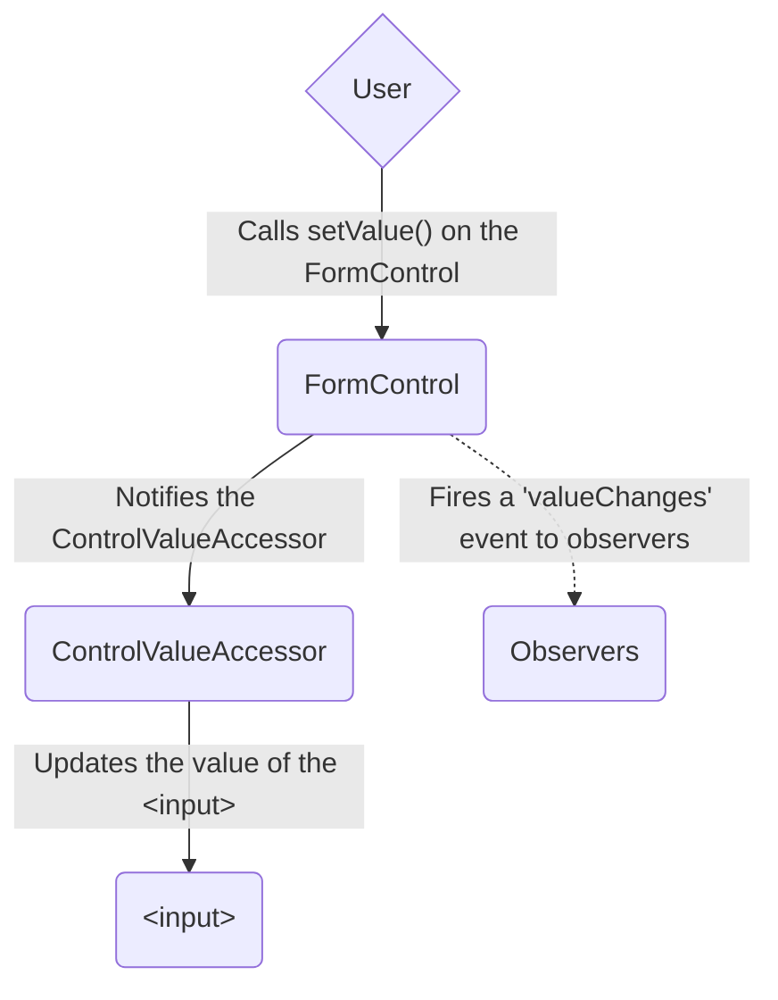
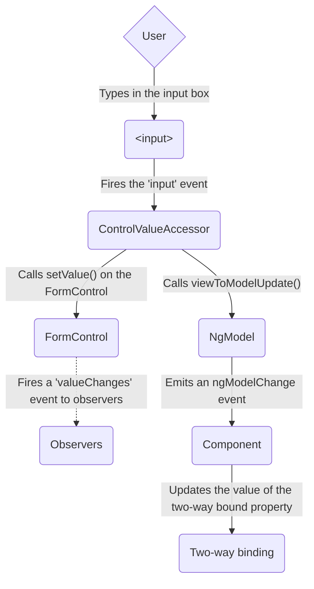
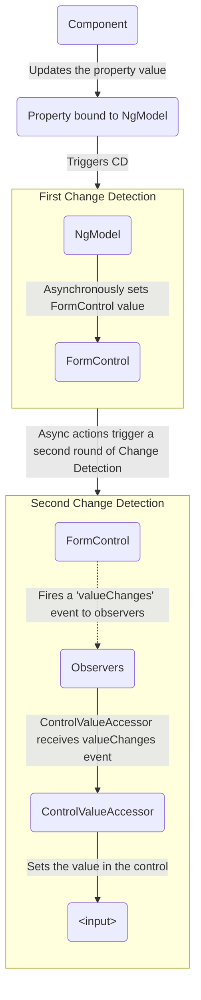

<docs-decorative-header title="Формы в Angular" imgSrc="adev/src/assets/images/overview.svg"> <!-- markdownlint-disable-line -->
Обработка пользовательского ввода с помощью форм является краеугольным камнем многих распространенных приложений.
</docs-decorative-header>

Приложения используют формы, чтобы позволить пользователям входить в систему, обновлять профиль, вводить
конфиденциальную информацию и выполнять множество других задач по вводу данных.

Angular предоставляет два разных подхода к обработке пользовательского ввода через формы: реактивные и управляемые
шаблоном (template-driven).

Оба подхода захватывают события ввода пользователя из представления, проверяют ввод пользователя, создают модель формы и
модель данных для обновления и предоставляют способ отслеживания изменений.

TIP: Если вы ищете новые экспериментальные формы с сигналами (Signal Forms), ознакомьтесь с
нашим [руководством по основам Signal Forms](/essentials/signal-forms)!

Это руководство предоставляет информацию, которая поможет вам решить, какой тип формы лучше всего подходит для вашей
ситуации.
Оно представляет общие строительные блоки, используемые обоими подходами.
Оно также суммирует ключевые различия между двумя подходами и демонстрирует эти различия в контексте настройки, потока
данных и тестирования.

## Выбор подхода

Реактивные формы и формы, управляемые шаблоном, обрабатывают и управляют данными формы по-разному.
Каждый подход предлагает разные преимущества.

| Forms                                               | Details                                                                                                                                                                                                                                                                                                                                                                                                                           |
|:----------------------------------------------------|:----------------------------------------------------------------------------------------------------------------------------------------------------------------------------------------------------------------------------------------------------------------------------------------------------------------------------------------------------------------------------------------------------------------------------------|
| Реактивные формы (Reactive forms)                   | Предоставляют прямой, явный доступ к объектной модели базовой формы. По сравнению с формами, управляемыми шаблоном, они более надежны: они более масштабируемы, пригодны для повторного использования и тестирования. Если формы являются ключевой частью вашего приложения или вы уже используете реактивные шаблоны для создания приложения, используйте реактивные формы.                                                      |
| Формы, управляемые шаблоном (Template-driven forms) | Полагаются на директивы в шаблоне для создания и управления базовой объектной моделью. Они полезны для добавления простой формы в приложение, такой как форма подписки на рассылку. Их легко добавить в приложение, но они не так хорошо масштабируются, как реактивные формы. Если у вас очень простые требования к форме и логика, которой можно управлять исключительно в шаблоне, формы, управляемые шаблоном, могут подойти. |

### Ключевые различия

В следующей таблице приведены основные различия между реактивными и управляемыми шаблоном формами.

|                                                      | Reactive                             | Template-driven                  |
|:-----------------------------------------------------|:-------------------------------------|:---------------------------------|
| [Настройка модели формы](#setting-up-the-form-model) | Явная, создается в классе компонента | Неявная, создается директивами   |
| [Модель данных](#mutability-of-the-data-model)       | Структурированная и неизменяемая     | Неструктурированная и изменяемая |
| [Поток данных](#data-flow-in-forms)                  | Синхронный                           | Асинхронный                      |
| [Валидация формы](#form-validation)                  | Функции                              | Директивы                        |

### Масштабируемость

Если формы являются центральной частью вашего приложения, масштабируемость очень важна.
Возможность повторного использования моделей форм в компонентах имеет решающее значение.

Реактивные формы более масштабируемы, чем формы, управляемые шаблоном.
Они предоставляют прямой доступ к API базовой формы и используют [синхронный поток данных](#data-flow-in-reactive-forms)
между представлением и моделью данных, что упрощает создание крупномасштабных форм.
Реактивные формы требуют меньше настройки для тестирования, и тестирование не требует глубокого понимания обнаружения
изменений для правильного тестирования обновлений форм и валидации.

Формы, управляемые шаблоном, ориентированы на простые сценарии и не так пригодны для повторного использования.
Они абстрагируют API базовой формы и используют [асинхронный поток данных](#data-flow-in-template-driven-forms) между
представлением и моделью данных.
Абстракция форм, управляемых шаблоном, также влияет на тестирование.
Тесты сильно зависят от ручного выполнения обнаружения изменений для правильной работы и требуют большей настройки.

## Настройка модели формы

Как реактивные, так и управляемые шаблоном формы отслеживают изменения значений между элементами ввода формы, с которыми
взаимодействуют пользователи, и данными формы в модели вашего компонента.
Два подхода используют общие базовые строительные блоки, но различаются тем, как вы создаете и управляете общими
экземплярами элементов управления формой.

### Общие базовые классы форм

Как реактивные, так и управляемые шаблоном формы построены на следующих базовых классах.

| Base classes           | Details                                                                             |
|:-----------------------|:------------------------------------------------------------------------------------|
| `FormControl`          | Отслеживает значение и статус валидации отдельного элемента управления формой.      |
| `FormGroup`            | Отслеживает те же значения и статус для коллекции элементов управления формой.      |
| `FormArray`            | Отслеживает те же значения и статус для массива элементов управления формой.        |
| `ControlValueAccessor` | Создает мост между экземплярами Angular `FormControl` и встроенными элементами DOM. |

### Настройка в реактивных формах

С реактивными формами вы определяете модель формы непосредственно в классе компонента.
Директива `[formControl]` связывает явно созданный экземпляр `FormControl` с конкретным элементом формы в представлении,
используя внутренний аксессор значения.

Следующий компонент реализует поле ввода для одного элемента управления, используя реактивные формы.
В этом примере моделью формы является экземпляр `FormControl`.

<docs-code language="angular-ts" path="adev/src/content/examples/forms-overview/src/app/reactive/favorite-color/favorite-color.component.ts"/>

IMPORTANT: В реактивных формах модель формы является источником истины; она предоставляет значение и статус элемента
формы в любой момент времени через директиву `[formControl]` на элементе `<input>`.

### Настройка в формах, управляемых шаблоном

В формах, управляемых шаблоном, модель формы является неявной, а не явной.
Директива `NgModel` создает и управляет экземпляром `FormControl` для данного элемента формы.

Следующий компонент реализует то же поле ввода для одного элемента управления, используя формы, управляемые шаблоном.

<docs-code language="angular-ts" path="adev/src/content/examples/forms-overview/src/app/template/favorite-color/favorite-color.component.ts"/>

IMPORTANT: В форме, управляемой шаблоном, источником истины является шаблон. Директива `NgModel` автоматически управляет
экземпляром `FormControl` за вас.

## Поток данных в формах

Когда приложение содержит форму, Angular должен синхронизировать представление с моделью компонента, а модель
компонента — с представлением.
Поскольку пользователи изменяют значения и делают выбор через представление, новые значения должны быть отражены в
модели данных.
Аналогично, когда логика программы изменяет значения в модели данных, эти значения должны быть отражены в представлении.

Реактивные и управляемые шаблоном формы различаются тем, как они обрабатывают поток данных от пользователя или от
программных изменений.
Следующие диаграммы иллюстрируют оба вида потока данных для каждого типа формы, используя поле ввода favorite-color,
определенное выше.

### Поток данных в реактивных формах

В реактивных формах каждый элемент формы в представлении напрямую связан с моделью формы (экземпляром `FormControl`).
Обновления от представления к модели и от модели к представлению являются синхронными и не зависят от того, как
рендерится UI.

Диаграмма "представление-в-модель" показывает, как данные текут, когда значение поля ввода изменяется из представления
через следующие шаги.

1. Пользователь вводит значение в элемент ввода, в данном случае любимый цвет _Blue_.
1. Элемент ввода формы генерирует событие "input" с последним значением.
1. `ControlValueAccessor`, прослушивающий события на элементе ввода формы, немедленно передает новое значение в
   экземпляр `FormControl`.
1. Экземпляр `FormControl` генерирует новое значение через observable `valueChanges`.
1. Любые подписчики observable `valueChanges` получают новое значение.

Диаграмма "модель-в-представление" показывает, как программное изменение модели распространяется на представление через
следующие шаги.

1. Пользователь вызывает метод `favoriteColorControl.setValue()`, который обновляет значение `FormControl`.
1. Экземпляр `FormControl` генерирует новое значение через observable `valueChanges`.
1. Любые подписчики observable `valueChanges` получают новое значение.
1. Аксессор значения элемента управления на элементе ввода формы обновляет элемент новым значением.

### Поток данных в формах, управляемых шаблоном

В формах, управляемых шаблоном, каждый элемент формы связан с директивой, которая управляет моделью формы внутри себя.

Диаграмма "представление-в-модель" показывает, как данные текут, когда значение поля ввода изменяется из представления
через следующие шаги.

1. Пользователь вводит _Blue_ в элемент ввода.
1. Элемент ввода генерирует событие "input" со значением _Blue_.
1. Аксессор значения элемента управления, прикрепленный к вводу, запускает метод `setValue()` на экземпляре
   `FormControl`.
1. Экземпляр `FormControl` генерирует новое значение через observable `valueChanges`.
1. Любые подписчики observable `valueChanges` получают новое значение.
1. Аксессор значения элемента управления также вызывает метод `NgModel.viewToModelUpdate()`, который генерирует событие
   `ngModelChange`.
1. Поскольку шаблон компонента использует двустороннюю привязку данных для свойства `favoriteColor`, свойство
   `favoriteColor` в компоненте обновляется значением, переданным событием `ngModelChange` (_Blue_).

Диаграмма "модель-в-представление" показывает, как данные текут от модели к представлению, когда `favoriteColor`
изменяется с _Blue_ на _Red_, через следующие шаги.

1. Значение `favoriteColor` обновляется в компоненте.
1. Начинается обнаружение изменений.
1. Во время обнаружения изменений вызывается хук жизненного цикла `ngOnChanges` на экземпляре директивы `NgModel`,
   поскольку значение одного из ее входных параметров изменилось.
1. Метод `ngOnChanges()` ставит в очередь асинхронную задачу для установки значения для внутреннего экземпляра
   `FormControl`.
1. Обнаружение изменений завершается.
1. На следующем тике выполняется задача установки значения экземпляра `FormControl`.
1. Экземпляр `FormControl` генерирует последнее значение через observable `valueChanges`.
1. Любые подписчики observable `valueChanges` получают новое значение.
1. Аксессор значения элемента управления обновляет элемент ввода формы в представлении последним значением
   `favoriteColor`.

NOTE: `NgModel` запускает второе обнаружение изменений, чтобы избежать ошибок `ExpressionChangedAfterItHasBeenChecked`,
поскольку изменение значения происходит во входной привязке.

### Изменяемость модели данных

Метод отслеживания изменений играет роль в эффективности вашего приложения.

| Forms                       | Details                                                                                                                                                                                                                                                                                                                                                                                                                                                                                                                                                                                                      |
|:----------------------------|:-------------------------------------------------------------------------------------------------------------------------------------------------------------------------------------------------------------------------------------------------------------------------------------------------------------------------------------------------------------------------------------------------------------------------------------------------------------------------------------------------------------------------------------------------------------------------------------------------------------|
| Реактивные формы            | Сохраняют модель данных чистой, предоставляя ее как неизменяемую (immutable) структуру данных. Каждый раз, когда в модели данных происходит изменение, экземпляр `FormControl` возвращает новую модель данных, а не обновляет существующую. Это дает вам возможность отслеживать уникальные изменения в модели данных через observable элемента управления. Обнаружение изменений более эффективно, поскольку ему нужно обновляться только при уникальных изменениях. Поскольку обновления данных следуют реактивным шаблонам, вы можете интегрироваться с операторами observable для преобразования данных. |
| Формы, управляемые шаблоном | Полагаются на изменяемость (mutability) с двусторонней привязкой данных для обновления модели данных в компоненте по мере внесения изменений в шаблоне. Поскольку при использовании двусторонней привязки данных нет уникальных изменений для отслеживания в модели данных, обнаружение изменений менее эффективно при определении того, когда требуются обновления.                                                                                                                                                                                                                                         |

Разница продемонстрирована в предыдущих примерах, которые используют элемент ввода favorite-color.

- В реактивных формах **экземпляр `FormControl`** всегда возвращает новое значение при обновлении значения элемента
  управления.
- В формах, управляемых шаблоном, **свойство favorite color** всегда модифицируется на новое значение.

## Валидация форм

Валидация является неотъемлемой частью управления любым набором форм.
Независимо от того, проверяете ли вы обязательные поля или запрашиваете внешний API на предмет существующего имени
пользователя, Angular предоставляет набор встроенных валидаторов, а также возможность создавать пользовательские
валидаторы.

| Forms                       | Details                                                                                                                                  |
|:----------------------------|:-----------------------------------------------------------------------------------------------------------------------------------------|
| Реактивные формы            | Определяют пользовательские валидаторы как **функции**, которые получают элемент управления для валидации.                               |
| Формы, управляемые шаблоном | Привязаны к **директивам** шаблона и должны предоставлять пользовательские директивы валидаторов, которые оборачивают функции валидации. |

Для получения дополнительной информации
см. [Валидация форм](guide/forms/form-validation#validating-input-in-reactive-forms).

## Тестирование

Тестирование играет большую роль в сложных приложениях.
Более простая стратегия тестирования полезна при проверке того, что ваши формы функционируют правильно.
Реактивные формы и формы, управляемые шаблоном, имеют разные уровни зависимости от рендеринга UI для выполнения
утверждений (assertions) на основе изменений элементов управления формы и полей формы.
Следующие примеры демонстрируют процесс тестирования форм с реактивными и управляемыми шаблоном формами.

### Тестирование реактивных форм

Реактивные формы предоставляют относительно простую стратегию тестирования, поскольку они обеспечивают синхронный доступ
к форме и моделям данных, и их можно тестировать без рендеринга UI.
В этих тестах статус и данные запрашиваются и манипулируются через элемент управления без взаимодействия с циклом
обнаружения изменений.

Следующие тесты используют компоненты favorite-color из предыдущих примеров для проверки потоков данных "
представление-в-модель" и "модель-в-представление" для реактивной формы.

<!--todo: make consistent with other topics -->

#### Проверка потока данных "представление-в-модель"

Первый пример выполняет следующие шаги для проверки потока данных "представление-в-модель".

1. Запросить представление для элемента ввода формы и создать пользовательское событие "input" для теста.
1. Установить новое значение для ввода на _Red_ и отправить событие "input" на элементе ввода формы.
1. Утверждать, что значение `favoriteColorControl` компонента совпадает со значением из ввода.

<docs-code header="Favorite color test - view to model" path="adev/src/content/examples/forms-overview/src/app/reactive/favorite-color/favorite-color.component.spec.ts" visibleRegion="view-to-model"/>

Следующий пример выполняет следующие шаги для проверки потока данных "модель-в-представление".

1. Использовать `favoriteColorControl`, экземпляр `FormControl`, для установки нового значения.
1. Запросить представление для элемента ввода формы.
1. Утверждать, что новое значение, установленное в элементе управления, совпадает со значением в вводе.

<docs-code header="Favorite color test - model to view" path="adev/src/content/examples/forms-overview/src/app/reactive/favorite-color/favorite-color.component.spec.ts" visibleRegion="model-to-view"/>

### Тестирование форм, управляемых шаблоном

Написание тестов с формами, управляемыми шаблоном, требует детального знания процесса обнаружения изменений и понимания
того, как директивы выполняются в каждом цикле, чтобы гарантировать, что элементы запрашиваются, тестируются или
изменяются в правильное время.

Следующие тесты используют компоненты favorite color, упомянутые ранее, для проверки потоков данных от представления к
модели и от модели к представлению для формы, управляемой шаблоном.

Следующий тест проверяет поток данных от представления к модели.

<docs-code header="Favorite color test - view to model" path="adev/src/content/examples/forms-overview/src/app/template/favorite-color/favorite-color.component.spec.ts" visibleRegion="view-to-model"/>

Вот шаги, выполняемые в тесте "представление-в-модель".

1. Запросить представление для элемента ввода формы и создать пользовательское событие "input" для теста.
1. Установить новое значение для ввода на _Red_ и отправить событие "input" на элементе ввода формы.
1. Запустить обнаружение изменений через тестовую фикстуру.
1. Утверждать, что значение свойства `favoriteColor` компонента совпадает со значением из ввода.

Следующий тест проверяет поток данных от модели к представлению.

<docs-code header="Favorite color test - model to view" path="adev/src/content/examples/forms-overview/src/app/template/favorite-color/favorite-color.component.spec.ts" visibleRegion="model-to-view"/>

Вот шаги, выполняемые в тесте "модель-в-представление".

1. Использовать экземпляр компонента для установки значения свойства `favoriteColor`.
1. Запустить обнаружение изменений через тестовую фикстуру.
1. Использовать метод `tick()` для имитации течения времени внутри задачи `fakeAsync()`.
1. Запросить представление для элемента ввода формы.
1. Утверждать, что значение ввода совпадает со значением свойства `favoriteColor` в экземпляре компонента.

## Следующие шаги

Чтобы узнать больше о реактивных формах, см. следующие руководства:

<docs-pill-row>
  <docs-pill href="guide/forms/reactive-forms" title="Реактивные формы"/>
  <docs-pill href="guide/forms/form-validation#validating-input-in-reactive-forms" title="Валидация форм"/>
  <docs-pill href="guide/forms/dynamic-forms" title="Динамические формы"/>
</docs-pill-row>

Чтобы узнать больше о формах, управляемых шаблоном, см. следующие руководства:

<docs-pill-row>
  <docs-pill href="guide/forms/template-driven-forms" title="Руководство по формам, управляемым шаблоном" />
  <docs-pill href="guide/forms/form-validation#validating-input-in-template-driven-forms" title="Валидация форм" />
  <docs-pill href="api/forms/NgForm" title="Справочник API директивы NgForm" />
</docs-pill-row>
