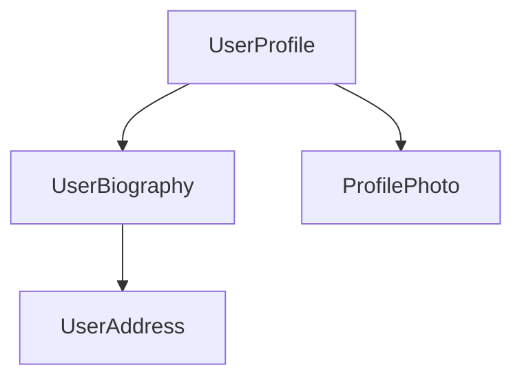

<docs-decorative-header title="Компоненты" imgSrc="adev/src/assets/images/components.svg"> <!-- markdownlint-disable-line -->
Фундаментальный строительный блок для создания приложений на Angular.
</docs-decorative-header>

Компоненты являются основными строительными блоками приложений Angular. Каждый компонент представляет собой часть
большей веб-страницы. Организация приложения с помощью компонентов помогает придать структуру вашему проекту, четко
разделяя код на конкретные части, которые легко поддерживать и развивать со временем.

## Определение компонента

Каждый компонент имеет несколько основных частей:

1. `@Component` [декоратор](https://www.typescriptlang.org/docs/handbook/decorators.html), который содержит некоторую
   конфигурацию, используемую Angular.
2. HTML-шаблон, который управляет тем, что рендерится в DOM.
3. [CSS-селектор](https://developer.mozilla.org/docs/Learn/CSS/Building_blocks/Selectors), который определяет, как
   компонент используется в HTML.
4. Класс TypeScript с поведением, таким как обработка пользовательского ввода или выполнение запросов к серверу.

Вот упрощенный пример компонента `UserProfile`.

```angular-ts
// user-profile.ts
@Component({
  selector: 'user-profile',
  template: `
    <h1>User profile</h1>
    <p>This is the user profile page</p>
  `,
})
export class UserProfile { /* Ваш код компонента здесь */ }
```

Декоратор `@Component` также опционально принимает свойство `styles` для любого CSS, который вы хотите применить к
вашему шаблону:

```angular-ts
// user-profile.ts
@Component({
  selector: 'user-profile',
  template: `
    <h1>User profile</h1>
    <p>This is the user profile page</p>
  `,
  styles: `h1 { font-size: 3em; } `,
})
export class UserProfile { /* Ваш код компонента здесь */ }
```

### Разделение HTML и CSS по отдельным файлам

Вы можете определить HTML и CSS компонента в отдельных файлах, используя `templateUrl` и `styleUrl`:

```angular-ts
// user-profile.ts
@Component({
  selector: 'user-profile',
  templateUrl: 'user-profile.html',
  styleUrl: 'user-profile.css',
})
export class UserProfile {
  // Поведение компонента определяется здесь
}
```

```angular-html
<!-- user-profile.html -->
<h1>User profile</h1>
<p>This is the user profile page</p>
```

```css
/* user-profile.css */
h1 {
  font-size: 3em;
}
```

## Использование компонентов

Вы строите приложение, составляя несколько компонентов вместе. Например, если вы создаете страницу профиля пользователя,
вы можете разбить ее на несколько компонентов следующим образом:



Здесь компонент `UserProfile` использует несколько других компонентов для создания финальной страницы.

Чтобы импортировать и использовать компонент, вам нужно:

1. В TypeScript-файле вашего компонента добавьте инструкцию `import` для компонента, который вы хотите использовать.
2. В вашем декораторе `@Component` добавьте запись в массив `imports` для компонента, который вы хотите использовать.
3. В шаблоне вашего компонента добавьте элемент, соответствующий селектору компонента, который вы хотите использовать.

Вот пример компонента `UserProfile`, импортирующего компонент `ProfilePhoto`:

```angular-ts
// user-profile.ts
import {ProfilePhoto} from 'profile-photo.ts';

@Component({
  selector: 'user-profile',
  imports: [ProfilePhoto],
  template: `
    <h1>User profile</h1>
    <profile-photo />
    <p>This is the user profile page</p>
  `,
})
export class UserProfile {
  // Поведение компонента определяется здесь
}
```

TIP: Хотите узнать больше о компонентах Angular? Смотрите [Углубленное руководство по компонентам](guide/components) для
получения полной информации.

## Следующий шаг

Теперь, когда вы знаете, как работают компоненты в Angular, пришло время узнать, как мы добавляем и управляем
динамическими данными в нашем приложении.

<docs-pill-row>
  <docs-pill title="Реактивность с сигналами" href="essentials/signals" />
  <docs-pill title="Углубленное руководство по компонентам" href="guide/components" />
</docs-pill-row>
