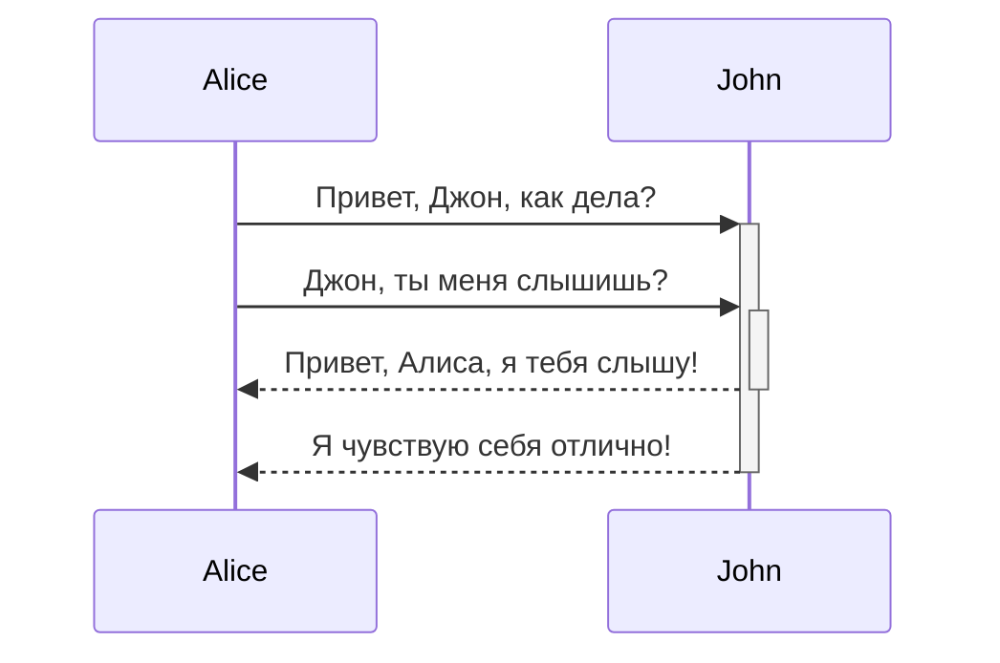
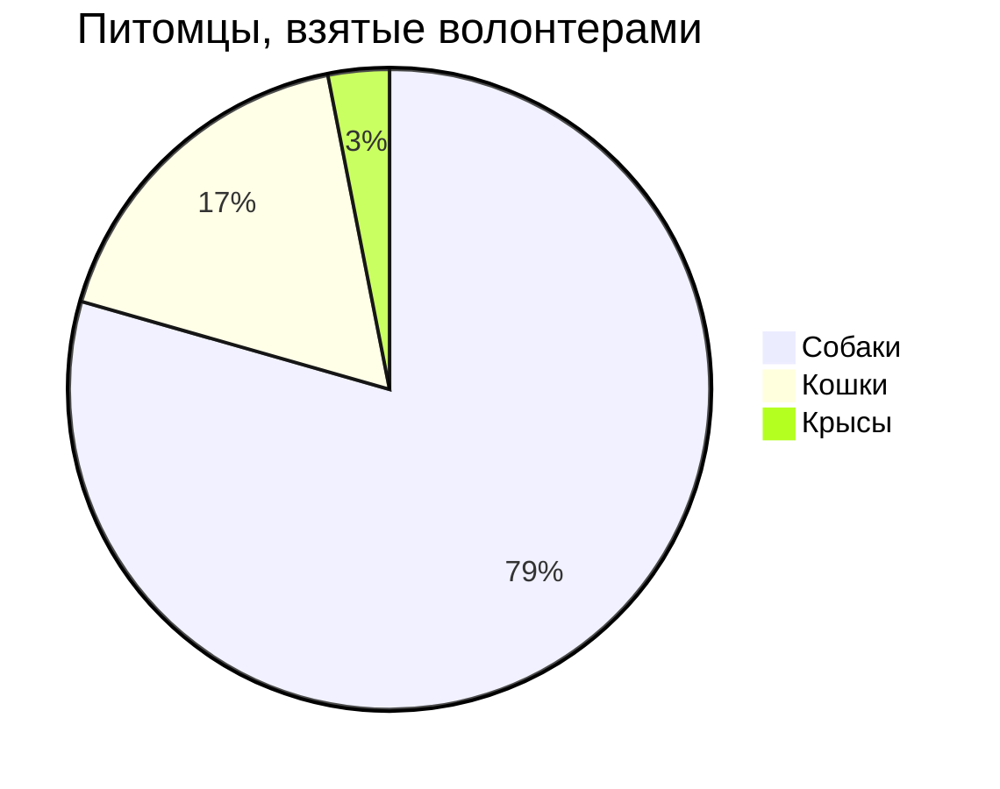

<docs-decorative-header title="Полный набор элементов" imgSrc="adev/src/assets/images/components.svg"> <!-- markdownlint-disable-line -->
Это наглядный список всех пользовательских компонентов и стилей для Angular.dev.
</docs-decorative-header>

Как дизайн-система, эта страница содержит визуальные руководства и инструкции по написанию Markdown для:

- Пользовательских элементов документации Angular: [`docs-card`](#cards), [`docs-callout`](#callouts), [
  `docs-pill`](#pills) и [`docs-steps`](#workflow)
- Пользовательских текстовых элементов: [уведомления (alerts)](#alerts)
- Примеров кода: [`docs-code`](#code)
- Встроенных стилизованных элементов Markdown: ссылок,
  списков, [заголовков](#headers-h2), [горизонтальных линий](#horizontal-line-divider)
- и многого другого!

Приготовьтесь:

1. Писать...
2. отличную...
3. документацию!

## Заголовки (h2) {#headers-h2}

### Заголовки поменьше (h3)

#### Еще меньше (h4)

##### Еще более маленькие (h5)

###### Самые маленькие! (h6)

## Карточки {#cards}

<docs-card-container>
  <docs-card title="Что такое Angular?" link="Обзор платформы" href="tutorials/first-app">
    Lorem ipsum dolor sit amet, consectetur adipiscing elit. Nullam ornare ligula nisi
  </docs-card>
  <docs-card title="Вторая карточка" link="Попробовать сейчас" href="essentials/what-is-angular">
    Lorem ipsum dolor sit amet, consectetur adipiscing elit. Nullam ornare ligula nisi
  </docs-card>
    <docs-card title="Карточка без ссылки">
    Lorem ipsum dolor sit amet, consectetur adipiscing elit. Nullam ornare ligula nisi
  </docs-card>
</docs-card-container>

### Атрибуты `<docs-card>`

| Атрибуты                 | Подробности                                             |
| :----------------------- | :------------------------------------------------------ |
| `<docs-card-container>`  | Все карточки должны быть вложены в контейнер            |
| `title`                  | Заголовок карточки                                      |
| содержимое тела карточки | Все, что находится между `<docs-card>` и `</docs-card>` |
| `link`                   | (Необязательно) Текст ссылки призыва к действию         |
| `href`                   | (Необязательно) Адрес ссылки призыва к действию         |

## Выноски {#callouts}

<docs-callout title="Заголовок полезной выноски">
  Lorem ipsum dolor sit amet, consectetur adipiscing elit. Nulla luctus metus blandit semper faucibus. Sed blandit diam quis tellus maximus, ac scelerisque ex egestas. Ut euismod lobortis mauris pretium iaculis. Quisque ullamcorper, elit ut lacinia blandit, magna sem finibus urna, vel suscipit tortor dolor id risus.
</docs-callout>

<docs-callout critical title="Заголовок критической выноски">
  Lorem ipsum dolor sit amet, consectetur adipiscing elit. Nulla luctus metus blandit semper faucibus. Sed blandit diam quis tellus maximus, ac scelerisque ex egestas. Ut euismod lobortis mauris pretium iaculis. Quisque ullamcorper, elit ut lacinia blandit, magna sem finibus urna, vel suscipit tortor dolor id risus.
</docs-callout>

<docs-callout important title="Заголовок важной выноски">
  Lorem ipsum dolor sit amet, consectetur adipiscing elit. Nulla luctus metus blandit semper faucibus. Sed blandit diam quis tellus maximus, ac scelerisque ex egestas. Ut euismod lobortis mauris pretium iaculis. Quisque ullamcorper, elit ut lacinia blandit, magna sem finibus urna, vel suscipit tortor dolor id risus.
</docs-callout>

### Атрибуты `<docs-callout>`

| Атрибуты                                              | Подробности                                                                    |
| :---------------------------------------------------- | :----------------------------------------------------------------------------- |
| `title`                                               | Заголовок выноски                                                              |
| содержимое тела выноски                               | Все, что находится между `<docs-callout>` и `</docs-callout>`                  |
| `helpful` (по умолчанию) \| `critical` \| `important` | (Необязательно) Добавляет стилизацию и иконки в зависимости от уровня важности |

## Pills {#pills}

Ряды pills полезны как вид навигации со ссылками на полезные ресурсы.

<docs-pill-row id=pill-row>
  <docs-pill href="#pill-row" title="Ссылка"/>
  <docs-pill href="#pill-row" title="Ссылка"/>
  <docs-pill href="#pill-row" title="Ссылка"/>
  <docs-pill href="#pill-row" title="Ссылка"/>
  <docs-pill href="#pill-row" title="Ссылка"/>
  <docs-pill href="#pill-row" title="Ссылка"/>
</docs-pill-row>

### Атрибуты `<docs-pill>`

| Атрибуты         | Подробности                                    |
| :--------------- | :--------------------------------------------- |
| `<docs-pill-row` | Все pills должны быть вложены в ряд (pill row) |
| `title`          | Текст pill                                     |
| `href`           | Ссылка pill                                    |

Pills также могут использоваться отдельно внутри строки, но мы это еще не реализовали.

## Уведомления (Alerts) {#alerts}

Уведомления — это просто специальные абзацы. Они полезны, чтобы выделить (не путать с выносками call-out) что-то более
срочное. Они получают размер шрифта из контекста и доступны во многих уровнях. Старайтесь не использовать уведомления
для отображения слишком большого количества контента, а скорее для улучшения и привлечения внимания к окружающему
контенту.

Стилизуйте уведомления, начиная с новой строки в Markdown, используя формат `УРОВЕНЬ_ВАЖНОСТИ` + `:` +
`ТЕКСТ_УВЕДОМЛЕНИЯ`.

NOTE: Используйте Note для вспомогательной/дополнительной информации, которая не является _существенной_ для основного
текста.

TIP: Используйте Tip, чтобы выделить конкретную задачу/действие, которое могут выполнить пользователи, или факт, который
напрямую влияет на задачу/действие.

TODO: Используйте TODO для незавершенной документации, которую вы планируете расширить в ближайшее время. Вы также
можете назначить TODO, например, TODO(emmatwersky): Текст.

QUESTION: Используйте Question, чтобы задать вопрос читателю, что-то вроде мини-викторины, на которую он должен быть в
состоянии ответить.

SUMMARY: Используйте Summary, чтобы предоставить краткий обзор (два-три предложения) содержания страницы или раздела,
чтобы читатели могли понять, подходит ли им это место.

TLDR: Используйте TL;DR (или TLDR), если можете предоставить суть информации о странице или разделе в одном или двух
предложениях. Например, TLDR: Ревень — это кот.

CRITICAL: Используйте Critical, чтобы предупредить о потенциальных проблемах или предупредить читателя, что ему следует
быть осторожным перед выполнением чего-либо. Например, Warning: Запуск `rm` с опцией `-f` удалит защищенные от записи
файлы или каталоги без запроса подтверждения.

IMPORTANT: Используйте Important для информации, которая критически важна для понимания текста или выполнения какой-либо
задачи.

HELPFUL: Используйте Best practice, чтобы выделить практики, которые известны как успешные или лучшие, чем альтернативы.

NOTE: Внимание, `разработчики`! Уведомления _могут_ содержать [ссылку](#alerts) и другие вложенные стили (но старайтесь
**использовать это умеренно**)!.

## Код {#code}

Вы можете отображать `код`, используя встроенные тройные обратные кавычки:

```ts
example code
```

Или используя элемент `<docs-code>`.

<docs-code header="Ваш первый пример" language="ts" linenums>
import { Component } from '@angular/core';

@Component({
selector: 'example-code',
template: '<h1>Hello World!</h1>',
})
export class ComponentOverviewComponent {}
</docs-code>

### Стилизация примера

Вот полностью стилизованный пример кода:

<docs-code
  path="adev/src/content/examples/hello-world/src/app/app.component-old.ts"
header="Стилизованный пример кода"
  language='ts'
  linenums
  highlight="[[3,7], 9]"
  preview
  visibleLines="[3,10]">
</docs-code>

У нас также есть стилизация для терминала, просто установите язык как `shell`:

```shell
npm install @angular/material --save
```

#### Атрибуты `<docs-code>`

| Атрибуты        | Тип                  | Подробности                                       |
| :-------------- | :------------------- | :------------------------------------------------ |
| code            | `string`             | Все между тегами воспринимается как код           |
| `path`          | `string`             | Путь к примеру кода (корень: `content/examples/`) |
| `header`        | `string`             | Заголовок примера (по умолчанию: `имя-файла`)     |
| `language`      | `string`             | язык кода                                         |
| `linenums`      | `boolean`            | (False) отображает номера строк                   |
| `highlight`     | `string of number[]` | подсвеченные строки                               |
| `diff`          | `string`             | путь к измененному коду                           |
| `visibleLines`  | `string of number[]` | диапазон строк для режима сворачивания            |
| `visibleRegion` | `string`             | **УСТАРЕЛО**, ИСПОЛЬЗУЙТЕ `visibleLines`          |
| `preview`       | `boolean`            | (False) отображать превью                         |
| `hideCode`      | `boolean`            | (False) Сворачивать ли пример кода по умолчанию.  |

### Многофайловые примеры

Вы можете создавать многофайловые примеры, оборачивая примеры в `<docs-code-multifile>`.

<docs-code-multifile
  path="adev/src/content/examples/hello-world/src/app/app.component.ts"
  preview>
<docs-code
    path="adev/src/content/examples/hello-world/src/app/app.component.html"
    highlight="[1]"
    linenums/>
<docs-code
    path="adev/src/content/examples/hello-world/src/app/app.component.css" />
</docs-code-multifile>

#### Атрибуты `<docs-code-multifile>`

| Атрибуты      | Тип       | Подробности                                      |
| :------------ | :-------- | :----------------------------------------------- |
| body contents | `string`  | вложенные вкладки примеров `docs-code`           |
| `path`        | `string`  | Путь к примеру кода для превью и внешней ссылки  |
| `preview`     | `boolean` | (False) отображать превью                        |
| `hideCode`    | `boolean` | (False) Сворачивать ли пример кода по умолчанию. |

### Добавление `preview` к вашему примеру кода

Добавление флага `preview` создает рабочий пример кода под фрагментом кода. Это также автоматически добавляет кнопку для
открытия рабочего примера в Stackblitz.

NOTE: `preview` работает только со standalone-компонентами.

### Стилизация превью примеров с помощью Tailwind CSS

Утилитарные классы Tailwind можно использовать внутри примеров кода.

<docs-code-multifile
  path="adev/src/content/examples/hello-world/src/app/tailwind-app.component.ts"
  preview>
<docs-code path="adev/src/content/examples/hello-world/src/app/tailwind-app.component.html" />
<docs-code path="adev/src/content/examples/hello-world/src/app/tailwind-app.component.ts" />
</docs-code-multifile>

## Вкладки

<docs-tab-group>
  <docs-tab label="Пример кода">
    <docs-code-multifile
      path="adev/src/content/examples/hello-world/src/app/tailwind-app.component.ts"
      hideCode="true"
      preview>
    <docs-code path="adev/src/content/examples/hello-world/src/app/tailwind-app.component.html" />
    <docs-code path="adev/src/content/examples/hello-world/src/app/tailwind-app.component.ts" />
    </docs-code-multifile>
  </docs-tab>
  <docs-tab label="Текст">
    Lorem ipsum dolor sit amet, consectetur adipiscing elit. Nulla luctus metus blandit semper faucibus. Sed blandit diam quis tellus maximus, ac scelerisque ex egestas. Ut euismod lobortis mauris pretium iaculis. Quisque ullamcorper, elit ut lacinia blandit, magna sem finibus urna, vel suscipit tortor dolor id risus.
  </docs-tab>
</docs-tab-group>

## Рабочий процесс (Workflow) {#workflow}

Стилизуйте нумерованные шаги с помощью `<docs-step>`. Нумерация создается с помощью CSS (удобно!).

### Атрибуты `<docs-workflow>` и `<docs-step>`

| Атрибуты             | Подробности                                             |
| :------------------- | :------------------------------------------------------ |
| `<docs-workflow>`    | Все шаги должны быть вложены в workflow                 |
| `title`              | Заголовок шага                                          |
| содержимое тела шага | Все, что находится между `<docs-step>` и `</docs-step>` |

Шаги должны начинаться с новой строки и могут содержать `docs-code` и другие вложенные элементы и стили.

<docs-workflow>

<docs-step title="Установка Angular CLI">
  Вы используете Angular CLI для создания проектов, генерации кода приложений и библиотек, а также выполнения различных текущих задач разработки, таких как тестирование, сборка и развертывание.

Чтобы установить Angular CLI, откройте окно терминала и выполните следующую команду:

```shell
npm install -g @angular/cli
```

</docs-step>

<docs-step title="Создание рабочей области и начального приложения">
  Вы разрабатываете приложения в контексте рабочей области Angular.

Чтобы создать новую рабочую область и начальное стартовое приложение:

- Выполните команду CLI `ng new` и укажите имя `my-app`, как показано здесь:

  ```shell
  ng new my-app
  ```

- Команда ng new запрашивает информацию о функциях, которые нужно включить в начальное приложение. Примите значения по
  умолчанию, нажав клавишу Enter или Return.

  Angular CLI устанавливает необходимые npm-пакеты Angular и другие зависимости. Это может занять несколько минут.

  CLI создает новую рабочую область и простое приложение Welcome, готовое к запуску.
  </docs-step>

<docs-step title="Запуск приложения">
  Angular CLI включает сервер для локальной сборки и обслуживания вашего приложения.

1. Перейдите в папку рабочей области, например `my-app`.
2. Выполните следующую команду:

   ```shell
   cd my-app
   ng serve --open
   ```

Команда `ng serve` запускает сервер, отслеживает ваши файлы и пересобирает приложение по мере внесения изменений в эти
файлы.

Опция `--open` (или просто `-o`) автоматически открывает ваш браузер по адресу <http://localhost:4200/>.
Если установка и настройка прошли успешно, вы должны увидеть страницу, похожую на следующую.
</docs-step>

<docs-step title="Последний шаг">
  Это все компоненты документации! Теперь:

  <docs-pill-row>
    <docs-pill href="#pill-row" title="Идите"/>
    <docs-pill href="#pill-row" title="пишите"/>
    <docs-pill href="#pill-row" title="отличную"/>
    <docs-pill href="#pill-row" title="документацию!"/>
  </docs-pill-row>
</docs-step>

</docs-workflow>

## Изображения и видео

Вы можете добавлять изображения, используя семантический Markdown для изображений:


### Добавьте `#small` и `#medium`, чтобы изменить размер изображения


## Добавление атрибутов с использованием синтаксиса фигурных скобок


Встроенные видео создаются с помощью `docs-video` и требуют только `src` и `alt`:

<docs-video src="https://www.youtube.com/embed/O47uUnJjbJc" alt=""/>

## Диаграммы и графики

Создавайте диаграммы и графики с помощью [Mermaid](http://mermaid.js.org/), установив язык кода как `mermaid`, вся
темизация встроена.






## Горизонтальный разделитель

Его можно использовать для разделения разделов страницы, как мы собираемся сделать ниже. Эти стили будут добавлены по
умолчанию, ничего настраивать не нужно.

<hr/>

Конец!
